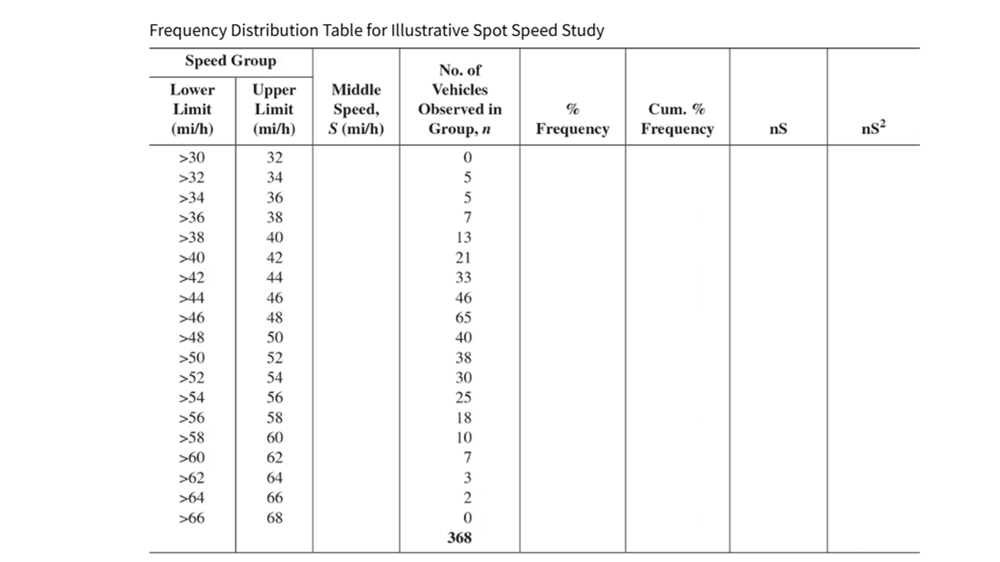
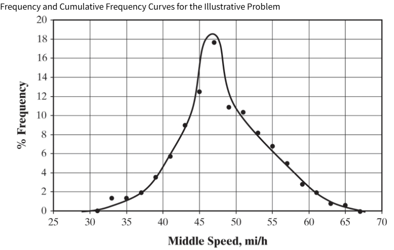
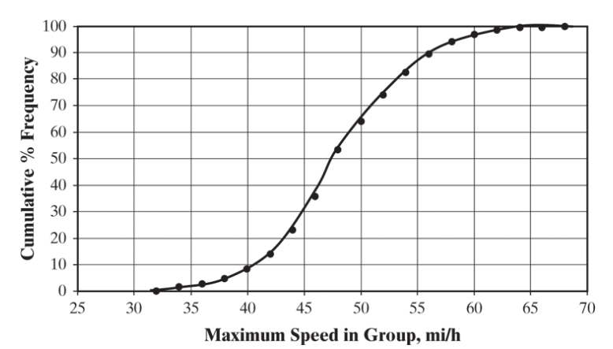

# Statistics in Transportation

## Chapter 11
### Ch 11: Speed, Travel Time, and Delay Studies

## Research Questions

* What is the average speed of vehicles on this road?
* What percentage of drivers travel above the speed limit?
* Do cars travel faster during off-peak hours than during rush hour?
* Is traffic volume higher on weekdays than on weekends?
* Is there a relationship between traffic volume and vehicle delay at an intersection?

## Research Questions

* What is the average speed of vehicles on this road?
  - Mean, median, range, standard deviation.
* What percentage of drivers travel above the speed limit?
  - Proportions and probability.
* Do cars travel faster during off-peak hours than during rush hour?
  -Comparing two groups and hypothesis testing.
* Is traffic volume higher on weekdays than on weekends?
  -Data collection, averages, and comparison.
* Is there a relationship between traffic volume and vehicle delay at an intersection?
* Scatterplots, correlation, and simple regression.

## Why?

### Transportation engineers use statistics because traffic, driver behavior, weather, and crashes vary every day; statistics helps us distinguish a real problem or improvement from ordinary random variation.

## Population vs. Sample

## Population vs. Sample

* RQ: What percentage of U.S. college students feel sleep-deprived?
  - What is the population of interest?

. . . 

  - **Sample: Take random sample of students across the US universities**

## Population vs. Sample

* RQ: What percentage of Univ. of SC students feel sleep-deprived?
  - What is the population of interest?
  
. . . 

  - **Sample: Take random sample of students at Univ. of SC**

## Speed Data

## Frequency Distribution

## Frequency Distribution

## Frequency Distribution

## Frequency Distribution

## Frequency Distribution

