# Statistics in Transportation

## Chapter 11
### Ch 11: Speed, Travel Time, and Delay Studies

## Research Questions

* What is the average speed of vehicles on this road?
* What percentage of drivers travel above the speed limit?
* Do cars travel faster during off-peak hours than during rush hour?
* Is traffic volume higher on weekdays than on weekends?
* Is there a relationship between traffic volume and vehicle delay at an intersection?

## Research Questions

* What is the average speed of vehicles on this road?
  - Mean, median, range, standard deviation.
* What percentage of drivers travel above the speed limit?
  - Proportions and probability.
* Do cars travel faster during off-peak hours than during rush hour?
  -Comparing two groups and hypothesis testing.
* Is traffic volume higher on weekdays than on weekends?
  -Data collection, averages, and comparison.
* Is there a relationship between traffic volume and vehicle delay at an intersection?
* Scatterplots, correlation, and simple regression.

## Why?

### Transportation engineers use statistics because traffic, driver behavior, weather, and crashes vary every day; statistics helps us distinguish a real problem or improvement from ordinary random variation.

## Population vs. Sample
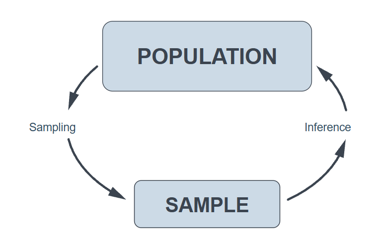

## Population vs. Sample

* RQ: What percentage of U.S. college students feel sleep-deprived?
  - What is the population of interest?

. . . 

  - **Sample: Take random sample of students across the US universities**

## Population vs. Sample

* RQ: What percentage of Univ. of SC students feel sleep-deprived?
  - What is the population of interest?
  
. . . 

  - **Sample: Take random sample of students at Univ. of SC**

## Speed Data {.smaller}
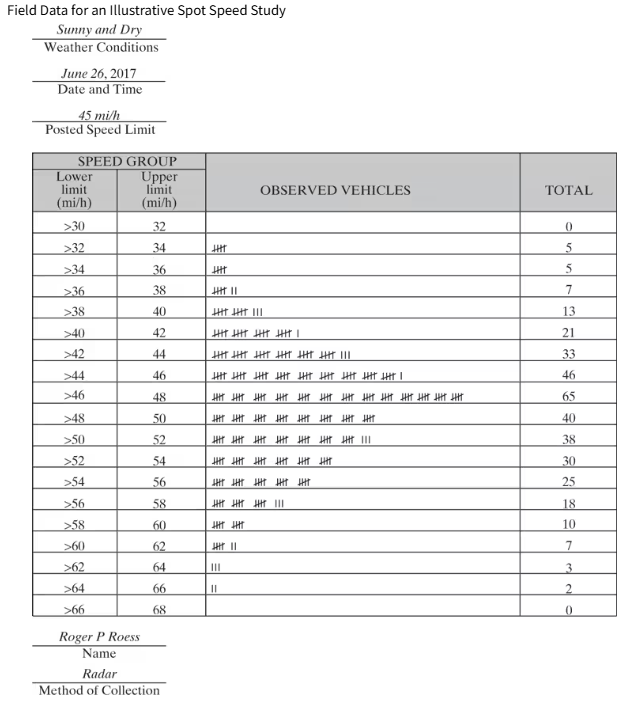

## Questions

::::: {.hierarchy .outline .stretch}
:::: item
Questions

::: item
Observed Data (sample)
:::

::: item
Future Events
:::
::::
:::::

## Questions - Observed Data {.smaller}
| Type of question                                 | Example                                               | Tool                           |
| ------------------------------------------------ | ----------------------------------------------------- | ------------------------------ |
| What did our observed vehicles do?               | “What was their average speed?”                       | Central Tendency (e.g., Mean)  |
| How variable were the observed speeds?           | “Were vehicles traveling at similar speeds?”          | Dispersion (e.g., SD)          |
| What fraction of the sample was in a range?      | “What percentage of the 368 vehicles was 46–48 mph?”  | Relative frequency             |

## Frequency Distribution Table
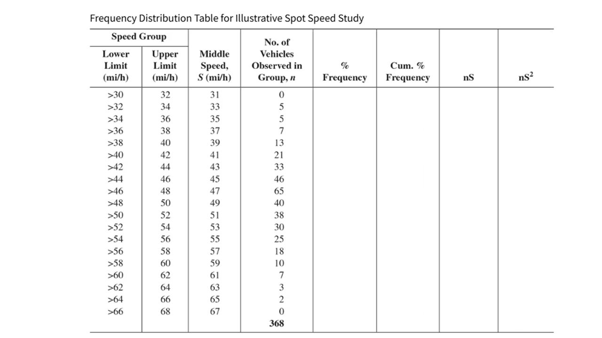

## Central Tendency {.smaller} 
#### What was the observed average speed?

::: {.columns}

::: {.column width="25%"}
* **Mean**: sum of observed values (speed) divided by number of obs
  - Mean, $\bar{x} = \frac{\sum{n_iS_i}}{N}$  
  - $\bar{x} = \frac{17736}{368}$
  - $\bar{x} = 48.2 mph$
:::

::: {.column width="75%"}
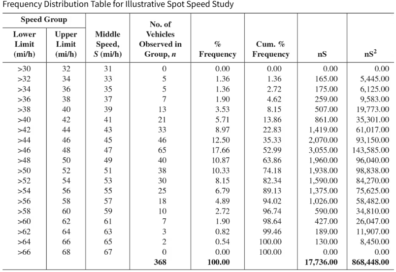
:::

:::

* <mark>**On an average, the observed vehicles are traveling at 48.2 mph**</mark>

## Central Tendency {.smaller} 
**<u>What was the speed certain portion of veh travelling?</u>**

::: {.columns}

::: {.column width="25%"}
* **Median**: 50%
  - Speed at $N/2 = 184$th vehicle (ordered data)
  - From Table, between $45$mph and $47$mph, 
  - Avg $46$mph
:::

::: {.column width="75%"}
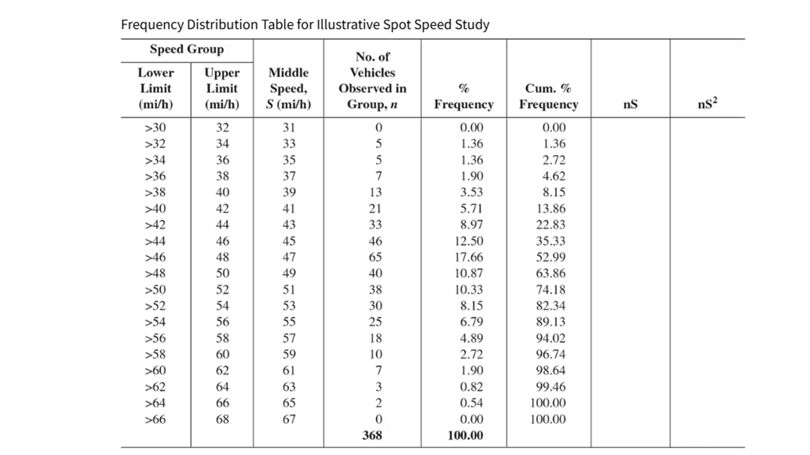
:::

:::

* <mark>**Half of the observed vehicles are traveling at 47 mph lower or higher.**</mark>

## Central Tendency {.smaller} 
**<u>What was the speed majority veh travelling?</u>**

::: {.columns}

::: {.column width="25%"}
* **Mode**: Most frequent speed 
  - From Table, highest freq(65) occurs at speed $47$mph, 
  - Mode: $46$mph
:::

::: {.column width="75%"}

:::

:::

* <mark>**Majority of observed vehicles are traveling at 47 mph.**</mark>

## Questions - Answer {.smaller} 
| Type of question                                 | Example                                               | Answer                         |
| ------------------------------------------------ | ----------------------------------------------------- | ------------------------------ |
| What did our observed vehicles do?               | “What was their average speed?”                       | **Mean: 48.2 ; Median: 47 mph ; Mode: 47 mph**|
| How variable were the observed speeds?           | “Were vehicles traveling at similar speeds?”          | Dispersion (e.g., SD)          |
| What fraction of the sample was in a range?      | “What percentage of the 368 vehicles was 46–48 mph?”  | Relative frequency             |

## Dispersion {.smaller}
**<u>Were observed vehicles traveling at similar speeds?</u>**

::: {.columns}

::: {.column width="30%"}
* **Range**: Low to High values
  - From table, speed range is $31$mph to $67$mph
:::

::: {.column width="70%"}

:::

:::

## Dispersion {.smaller}
**<u>Were observed vehicles traveling at similar speeds?</u>**

* **Standard Deviation (SD)**:
  - how far data spread around the mean value
  - $s = \sqrt{\frac{\sum_{i}(x_i - \bar{x})^2}{N-1}}$

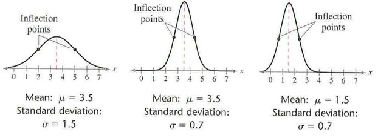

## Dispersion {.smaller}
**<u>Were observed vehicles traveling at similar speeds?</u>**

::: {.columns}

::: {.column width="30%"}
* **SD** for grouped frequency  
  - $sd = \sqrt{\frac{\sum_{i}n_iS_i^2 - N\bar{x}^2}{N-1}}$  
  - $sd = \sqrt{\frac{\sum_{i}868448 - 368 \times (48.2)^2}{368-1}}$  
  - $sd= 6.14$ mph  
:::

::: {.column width="70%"}

:::

:::

## Questions - Answer {.smaller} 
| Type of question                                 | Example                                               | Answer                         |
| ------------------------------------------------ | ----------------------------------------------------- | ------------------------------ |
| What did our observed vehicles do?               | “What was their average speed?”                       | **Mean: 48.2 ; Median: 47 mph ; Mode: 47 mph**|
| How variable were the observed speeds?           | “Were vehicles traveling at similar speeds?”          | **range: (31 - 67)mph; sd = 6.14 mph**        |
| What fraction of the sample was in a range?      | “What percentage of the 368 vehicles was 46–48 mph?”  | Relative frequency             |

## Relative Frequency {.smaller}
**<u>What percentage of the 368 vehicles was 46–48 mph?</u>**

::: {.columns}

::: {.column width="30%"}
* From Table, 65 out of 368 are in speed group (46-48] mph
* Relative frequency = $\frac{65}{368} = 17.66\%$
:::

::: {.column width="70%"}

:::

:::

## Relative Frequency {.smaller}
**<u>What percentage of the 368 vehicles speed was below 38 mph?</u>**

::: {.columns}

::: {.column width="30%"}
* From Table,  $5+5+7 = 17$ out of 368 are in below speed 38 mph
* Relative frequency = $\frac{17}{368} = 4.62\%$
* Alternatively see cumulative freq
:::

::: {.column width="70%"}

:::

:::

## Questions - Answer {.smaller} 
| Type of question                                 | Example                                               | Answer                         |
| ------------------------------------------------ | ----------------------------------------------------- | ------------------------------ |
| What did our observed vehicles do?               | “What was their average speed?”                       | **Mean: 48.2 ; Median: 47 mph ; Mode: 47 mph**|
| How variable were the observed speeds?           | “Were vehicles traveling at similar speeds?”          | **range: (31 - 67)mph; sd = 6.14 mph**        |
| What fraction of the sample was in a range?      | “What percentage of the 368 vehicles was 46–48 mph?”  | **$17.66\%$**         |

## Questions - Prediction
| Type of question                                 | Example                                               | Tool                           |
| ------------------------------------------------ | ----------------------------------------------------- | ------------------------------ |
| What may happen for a future vehicle?            | “What is the chance a vehicle exceeds 50 mph?”        | PDF/CDF or Normal distribution |
| What may happen in a future group?               | “How many of the next 10 vehicles may exceed 50 mph?” | Binomial distribution          |
| How many vehicles may arrive in a time interval? | “How many accidents in a given day?”           | Poisson distribution           |

## Frequency Histogram

::: {.columns}

::: {.column width="70%"}
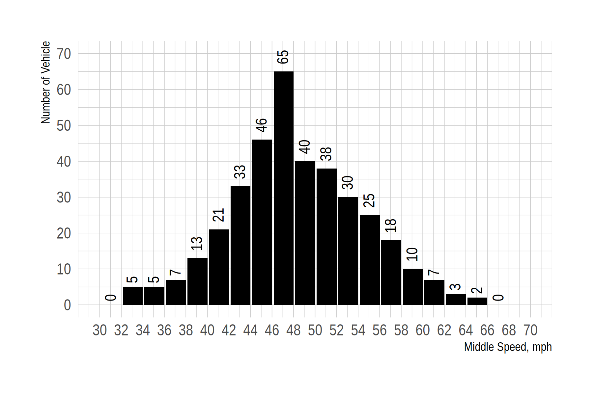
:::

::: {.column width="30%"}

:::

:::
## Relative Frequency Histogram
::: {.columns}

::: {.column width="70%"}
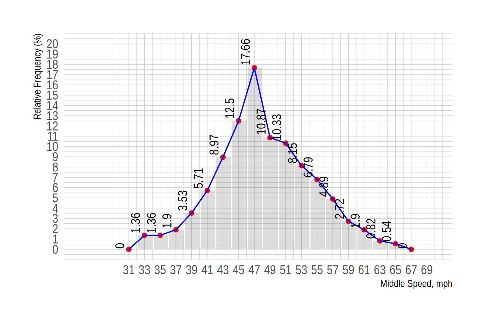
:::

::: {.column width="30%"}

:::

:::

## Probability {.smaller}

**<u>What is the chance a vehicle exceeds 50 mph??</u>**

::: {.columns}

::: {.column width="40%"}
* Observed Data 
  - Number of veh exceed 50 mph is 133
  - P(speed > 50 mph) = $133 / 165 = 0.361$
:::

::: {.column width="60%"}

:::

:::

## Probability {.smaller}

**<u>What is the chance a vehicle exceeds 50 mph??</u>**

::: {.columns}

::: {.column width="40%"}
* Using Relative Freq. 
  - Add relative freq above 50 mph
  - P(speed > 50 mph) = 0.361$
:::

::: {.column width="60%"}

:::

:::

## Probability Distribution {.smaller}

**<u>What is the chance a vehicle exceeds 50 mph??</u>**

* Assume that the speed data follows a Normal Distribution^[[Normal Distribution](https://mabognar.github.io/apps/normal.html)] 
  - Let, $X$ = speed of randomly selected vehicle (<mark>Continuous RV</mark>)
  - $\bar{x}=48.20 mph$
  - $s.d. = 6.10 mph$
  - $X \sim \mathcal{N}(\mu = 48.20, \sigma = 6.10)$
  - $X \sim \mathcal{N}(\mu = 48.20, \sigma^2 = 6.10^2)$

## Probability Distribution {.smaller}

**<u>What is the chance a vehicle exceeds 50 mph??</u>**

::: {.notes}
[Probability Distribution](https://probabilityplayground.com/binomial.html)
:::
* What is the chance a vehicle speed ($\mathcal{X}$) exceeds 50 mph ($x$)??
* $P(\mathcal{X}>x) = P(\mathcal{X}>50mph) = ?$
  - Using app, $P(X>50) = 0.384$ very close to previous $0.361$
* Standard Normal Distribution: $\sim \mathcal{N}(\mu = 0, \sigma = 1)$
* How to convert? 
  - $\mathcal{X} \sim \mathcal{N}(\mu = 48.20, \sigma = 6.10)$ $\to$ $\mathcal{Z} \sim \mathcal{N}(\mu = 0, \sigma = 1)$
  - $z= \frac{x- \mu}{\sigma}$
  - $z= \frac{50- 48.20}{6.10}$
  - $z= 0.295$
  

## Probability Distribution {.smaller}

**<u>What is the chance a vehicle exceeds 50 mph??</u>**

::: {.notes}
[Probability Distribution](https://probabilityplayground.com/binomial.html)
:::
* What is the chance a vehicle speed ($\mathcal{X}$) exceeds 50 mph ($x$)??
* $P(\mathcal{X}>50) = P(\mathcal{Z}>0.295) = ?$
  - From table^[[Normal Table](https://archive.math.arizona.edu/rsims/ma464/standardnormaltable.pdf)], $P(\mathcal{Z}<0.295) = 0.614$
  - $P(\mathcal{Z}>0.295) = 1 - P(\mathcal{Z}<0.295) = 0.386$
  - very close to previous $0.361$

## Questions - Prediction Answer
| Type of question                                 | Example                                               | Tool                           |
| ------------------------------------------------ | ----------------------------------------------------- | ------------------------------ |
| What may happen for a future vehicle?            | “What is the chance a vehicle exceeds 50 mph?”        | **0.386** |
| What may happen in a future group?               | “How many of the next 10 vehicles may exceed 50 mph?” | Binomial distribution          |
| How many vehicles may arrive in a time interval? | “How many accidents in a given day?”          | Poisson distribution           |

## Probability Distribution 

* Random Variable: *A random variable is a variable that takes on different values determined by chance.*
  - Discrete
  - Continuous

## Discrete Probability Distribution 

* Dataset: [0,1,2,3,4]
* R.V., $\mathcal{X}$ = a random draw from these values
  - what is the probability you select 2?
  - what is the probability you select 3?

| $x$ | $P(X=x)$ | $P(X \le x)$ |
| --| -------| ------|
| 0 | 1/5  | 1/5 |
| 1 | 1/5  | 2/5 |
| 2 | 1/5  | 3/5 |
| 3 | 1/5  | 4/5 |
| 4 | 1/5  | 5/5 | 

## Discrete Probability Distribution
#### Binomial Distribution

1. The experiment consists of $n$ identical trials (is fixed).
2. Each trial results in one of the two outcomes, called success and failure.
3. The probability of success, denoted $p$, remains the same from trial to trial.
4. The trials are independent. That is, the outcome of any trial does not affect the outcome of the others.

$$P(X) = \frac{n!}{n!(n-x)!} p^x (1-p)^{n-x}$$

## Probability Distribution {.smaller}

**<u>what is the probability that exactly 4 will travel at least 50 mph of the next 10 vehicles?</u>**

* $\mathcal{X}$ =number of vehicles ($x$), among the next 10, traveling at least 50 mph (<mark>Discrete RV</mark>)
* $P(X=x) = \frac{n!}{n!(n-x)!} p^x (1-p)^{n-x}$
  - $x = 4$
  - $n = 10$
  - From Observed data: $P(speed > 50mph) = p = 0.361$
* $P(\mathcal{X}=4) = \frac{10!}{10!(10-4)!} 0.361^4 \times (1-0.361)^{10-4}$
* $P(\mathcal{X}=4) = 0.243$
    
## Questions - Prediction Answer {.smaller}
| Type of question                                 | Example                                               | Tool                           |
| ------------------------------------------------ | ----------------------------------------------------- | ------------------------------ |
| What may happen for a future vehicle?            | “What is the chance a vehicle exceeds 50 mph?”        | **0.386** |
| What may happen in a future group?               | “How many of the next 10 vehicles may exceed 50 mph?” |  **0.243** |
| How many vehicles may arrive in a time interval? | “How many accidents in a given day?”           | Poisson distribution           |

## Discrete Probability Distribution
#### Poisson Distribution

* Discrete R.V.  denote $\mathcal{X$ the number of times an event occurs in an interval of time (or space).

## Probability Distribution {.smaller}
**<u>At a particular interchange, the average number of accidents per day is 5.  Assuming the number of accidents at this location is Poisson distributed, what is the probability that the number of accidents is less than 3 on a given day?
</u>**

* Assume, $\mathcal{X} \sim Poisson(\lambda,x)$
  - $P(\mathcal{X}=x) = \frac{(\lambda t)^x e^{-\lambda t}}{x!}$
    - $P(\mathcal{X}=x)$ = The probability of x successes.
    - $\lambda$= The average or mean number of events in the given interval.
    - $t$ = given interval
    - $e$ = $2.71828$

## Probability Distribution {.smaller}
**<u>At a particular interchange, the average number of accidents per day is 5.  Assuming the number of accidents at this location is Poisson distributed, what is the probability that the number of accidents is less than 3 on a given day?
</u>**

* Let, $\mathcal{X}$ = number of accidents
  - $P(\mathcal{X} < x) = \frac{(\lambda t)^x e^{-\lambda t}}{x!}$
    - $P(\mathcal{X} < 3)$ = The probability of less than (x=) 3 accident.
    - $\lambda= 5$ accidents / day.
    - $t = 1$ day
    - $\lambda t = 5$
    - $e$ = $2.71828$
* $P(\mathcal{X} < 3) = P(\mathcal{X} = 0) + P(\mathcal{X} = 1) +P(\mathcal{X} = 2)$ 
* $P(\mathcal{X} < 3) = \frac{(5)^0 e^{-5}}{0!} + \frac{(5)^1 e^{-5}}{1!}+ \frac{(5)^2 e^{-5}}{2!}$ 
* $P(\mathcal{X} < 3) = 0.12465$

## Questions - Prediction Answer {.smaller}
| Type of question                                 | Example                                               | Tool                           |
| ------------------------------------------------ | ----------------------------------------------------- | ------------------------------ |
| What may happen for a future vehicle?            | “What is the chance a vehicle exceeds 50 mph?”        | **0.386** |
| What may happen in a future group?               | “How many of the next 10 vehicles may exceed 50 mph?” |  **0.243** |
| How many vehicles may arrive in a time interval? | “How many accidents in a given day?”           | **0.125**           |

## Continuous Probability Dist {.smaller}

::: {.columns}

::: {.column width="40%"}
* The Normal Distribution is a family of continuous distributions that can model many histograms of real-life data which are mound-shaped (bell-shaped) and symmetric (for example, speed.).

* A normal curve has two parameters:
  - mean $\mu$ (center of the curve)
  - standard deviation $\sigma$ (spread about the center)

:::

::: {.column width="60%"}
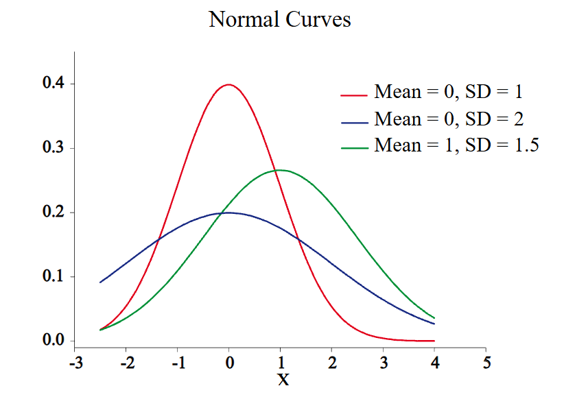
:::

:::

## Normal Distribution {.smaller}
**<u>Suppose the speeds on a highway is normally distributed with 𝜇 = 55 and s = 7.  What is the probability that the next observed vehicle will be 65 mi/hr or less?  What is the probability that the speed of the next vehicle is between 45 and 65 mi/hr?</u>**

* [Normal Distribution](https://mabognar.github.io/apps/normal.html)  
* PDF of $\mathcal{N}$, $f(x) = \frac{1}{\sigma \sqrt{2 \pi}}e^{\frac{-(x-\mu)^2}{2\sigma^2}}$
* Let, $\mathcal{X}$ = Speed of the vehicle  
  - $\mathcal{X} \sim \mathcal{N}(55,7^2)$  
  - $P(X \le 65) = \int_{\infty}^{65} f(x) \, dx$  
  - $P(X \le 65) = \int_{\infty}^{65} \frac{1}{7 \sqrt{2 \pi}}e^{\frac{-(x-55)^2}{2 \times 7^2}} \, dx$
  - $P(X \le 65)$ = Area under the curve
  - $P(X \le 65) = 0.9234$

## Normal Distribution {.smaller}
**<u>Suppose the speeds on a highway is normally distributed with 𝜇 = 55 and s = 7.  What is the probability that the next observed vehicle will be 65 mi/hr or less?  What is the probability that the speed of the next vehicle is between 45 and 65 mi/hr?</u>**

* [Normal Distribution](https://mabognar.github.io/apps/normal.html)  
* PDF of $\mathcal{N}$, $f(x) = \frac{1}{\sigma \sqrt{2 \pi}}e^{\frac{-(x-\mu)^2}{2\sigma^2}}$
* Let, $\mathcal{X}$ = Speed of the vehicle  
  - $\mathcal{X} \sim \mathcal{N}(55,7^2)$  
  - $P(45 \le X \le 65) = \int_{45}^{65} f(x) \, dx$  
  - $P(45 \le X \le 65) = 0.9234 - 0.0765$
  - $P(X \le 65) = 0.8469$

## Normal Distribution {.smaller}
### Empirical Rule
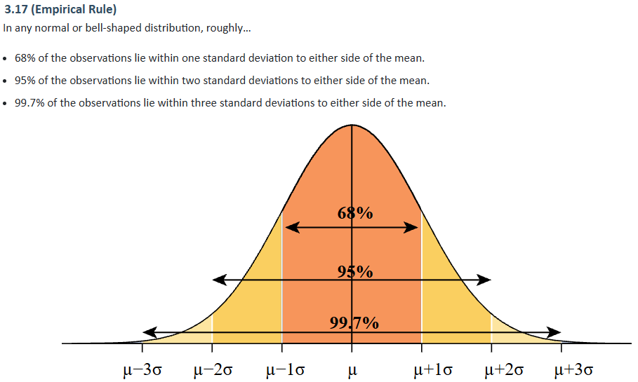

## Confidence Interval {.smaller}

::: {.columns}

::: {.column width="50%"}
### Population
* $\mu$ = population mean
* $\sigma$ = population standard deviation
:::

::: {.column width="50%"}
### Sample
* $\bar{x}$ = sample mean
* $s$ = sample standard deviation
:::

:::

## Confidence Interval (C.I.) {.smaller}
* The confidence interval gives a range of values within which the true population value falls.
* A 95% interval means that we are 95% confident that the population mean is in the interval. $\alpha = 0.05$
* The confidence interval is computed as follows:
* C.I = sample estimate $\pm$ margin of error
* C.I = $\bar{x}$ $\pm$ margin of error
  - margin of error (M) = error tolerance, $e$
    - $M = \mathcal{z}_{\alpha/2} \times SE(estimate)$
    - If sample estimate ($\bar{x}$) is normally distributed, $SE(estimate) = \frac{\sigma}{\sqrt{n}}$
* (1-$\alpha$)% C.I. for $\mu$ when $\sigma$ is known:
  - $C.I. = \bar{x} \pm \mathcal{z}_{\alpha/2} \frac{\sigma}{\sqrt{n}}$
* (1-$\alpha$)% C.I. for $\mu$ when $\sigma$ is unknown:
  - $C.I. = \bar{x} \pm \mathcal{t}_{\alpha/2} \frac{s}{\sqrt{n}}$

## Confidence Interval
::: {.columns}

::: {.column width="40%"}
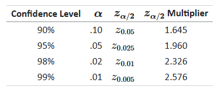

:::

::: {.column width="60%"}
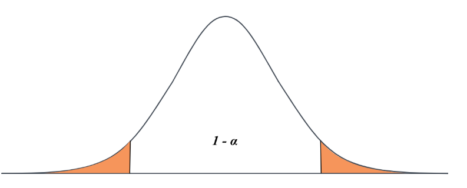
:::

:::

## Confidence Interval {.smaller}
**<u>For a vehicle speed dataset, sample size n = 100, mean speed is 55, standard deviation is 7, what is the 95% confidence interval?</u>**

* $C.I. = \bar{x} \pm \mathcal{z}_{\alpha/2} \frac{\sigma}{\sqrt{n}}$
  - $\alpha = 0.05$
  - $1 - (\alpha / 2) =  0.975$
  - From Table^[[Normal Table](https://archive.math.arizona.edu/rsims/ma464/standardnormaltable.pdf)]  $\mathcal{Z}_{\alpha/2}= 1.96$
  - $C.I. = 55 \pm 1.96 \frac{7}{\sqrt{100}}$
  - $C.I. = (53.628, 56.37)$

## Min Sample Size {.smaller}
**<u>For a vehicle speed dataset, sample size n = 100, mean speed is 55, standard deviation is 7, what is the 95% confidence interval?</u>**

* If the mean of the data is Normally distributed, then the minimum number of measurements needed can be computed as follows:
* $e$ = error tolerance = $\mathcal{z}_{\alpha/2} \times SE(estimate)$
* $e = \mathcal{z}_{\alpha/2} \times \frac{\sigma}{\sqrt{n}}$
* $n = (\frac{\mathcal{z}_{\alpha/2} \sigma}{e})^2$
* $n \ge (\frac{\mathcal{z}_{\alpha/2} \sigma}{e})^2$

## Min Sample Size 
**<u>For a vehicle speed dataset, sample size n = 100, mean speed is 55, standard deviation is 7. , If the desired CI is 95% what is the sample size needed  where the sample mean is within 1 mi/hr of the true population mean ?</u>**

* $n \ge (\frac{\mathcal{z}_{\alpha/2} \sigma}{e})^2$
* $n \ge (\frac{1.96 \times 7}{1})^2$
* $n \ge 188$

# Hypothesis Testing

## Hypothesis Testing: Purpose

::: {.columns}

::: {.column width="50%"}
* To use sample data to decide whether there is enough evidence for a **claim** about a larger population.
:::

::: {.column width="50%"}
::: {.process .vertical .node-circle}
::: item
Population
:::
::: item
Sample
:::
:::
:::

:::

## Hypothesis Testing {.smaller}
#### Compare Two Population Mean 

::: {.columns}

::: {.column width="50%"}
#### Population 1
* $\mu_1$ = population mean
* $\sigma_1$ = population standard deviation

:::

::: {.column width="50%"}
#### Population 2
* $\mu_2$ = population mean
* $\sigma_2$ = population standard deviation

:::

:::

## Hypothesis Testing: Question

* Is there significant difference in population means, $\mu_1$ and $\mu_2$?

## Hypothesis Testing {.smaller}
#### Compare Two Population Mean 

::: {.columns}

::: {.column width="50%"}
#### Population 1
* $\mu_1$ = population mean
* $\sigma_1$ = population standard deviation

#### Sample 1
* $\bar{x_1}$ = sample mean
* $s_1$ = sample standard deviation
:::

::: {.column width="50%"}
#### Population 2
* $\mu_2$ = population mean
* $\sigma_2$ = population standard deviation

#### Sample 2
* $\bar{x_2}$ = sample mean
* $s_2$ = sample standard deviation
:::
:::
* Is there significant difference in population means, $\mu_1$ and $\mu_2$?
  - different in population mean: $(\mu_1 - \mu_2)$ --> UNKNOWN
  - Use different in sample mean $(\bar{x_1} - \bar{x_2})$ to estimate $(\mu_1 - \mu_2)$

## Hypothesis testing
* Large sample inferences for two means
* Small sample inferences for two means
  - Independent samples and equal variances
  - Independent samples and unequal variances
  - paired samples
* Inferences for two variances
* Using p-values to report test results

## Hypothesis testing Steps {.smaller}
1. **Formulate the null and alternative hypotheses.** 
  - Null hypothesis $H_0$ usually represents the status quo
  - Alternative hypothesis $H_a$ is the hypothesis you will accept you reject H0.
2. **Select the significance level**: $\alpha$ 
3. **Use the sample data to calculate the value of the test statistic ($z^* or t^* or F*$).**
  - $H_a$: $(\mu_1 \neq \mu_2)$; REJECT $H_0$ when $[ |test\ statistics|\ \ge\ |critical\ value_{\alpha/2}| ]$ 
  - $H_a$: $(\mu_1 < \mu_2)$; REJECT $H_0$ when $[ test\ statistics\ <\ - critical\ value_{\alpha} ]$ 
  - $H_a$: $(\mu_1 > \mu_2)$; REJECT $H_0$ when $[ test\ statistics\ >\ critical\ value_{\alpha} ]$ 
4. **Use Probability Distribution ($Z$ or $t$ or $F$) to determine the rejection region of $H_0$.**
5. **State conclusion of the test.** 

::: {.notes}
If the value of the test
statistic is in the rejection region, then reject H0 and
accept HA. Otherwise, conclude that there is insufficient
evidence to reject H0.

(the probability of
rejecting a hypothesis that should be accepted). For
engineering applications, is usually 0.05 or 5%. This is
the same as saying (1-)% confidence level.
::: 

## HT: Large sample {.smaller}
**<u>Speed data were collected at a section of highway before and after lane widening.  The speed characteristics are given below.  <mark>Determine whether there was any significant difference between the average speed at the 95% confidence level.</mark></u>**

|       Before            |   After               | 
|:-----------------------:|:---------------------:|
| $\bar{x_1} = 35.5 mph$  | $\bar{x_2} = 38.7 mph$|
| $s_1 = 7.5 mph$   | $s_2 = 7.4 mph$ |
| $n_1 = 250$             | $n_2 = 280$           |

## HT: Large sample {.smaller}
Determine whether there was any significant difference between the average speed at the 95% confidence level.</u>**

|       Before            |   After               | 
|:-----------------------:|:---------------------:|
| $\bar{x_1} = 35.5 mph$  | $\bar{x_2} = 38.7 mph$|
| $s_1 = 7.5 mph$   | $s_2 = 7.4 mph$ |
| $n_1 = 250$             | $n_2 = 280$           |

* Given, CI = $(1-\alpha) = 0.95$ 
* **<u>Step 0</u>**: Check for large Sample 
  - If $n_1 \ge 30$ and $n_2 \ge 30$ larges sample and follows approx. Normal Dist. (CLT) 
  - Given, $n_1= 280$ and $n_2 = 280$; So, large sample

. . . 

* **<u>Step 1</u>**: Formulate Hypothesis
  - $H_0$: no difference in average speed $(\mu_1 = \mu_2)$ 
  - $H_0$: average speed after lane widening differs from previous $(\mu_1 \neq \mu_2)$ 

. . . 

* **<u>Step 2</u>**: significance level: 
  - $\alpha$ = $(1-CI)$ = $0.05$ 

. . . 

* **<u>Step 3</u>** Calculate test statistic ($z^*$) using sample data  
  - $z^* = \frac{\bar{x_1} - \bar{x_2}}{S_d}$ ; $S_d = \sqrt{\frac{s_1^2}{n_1} + \frac{s_2^2}{n_2}}$  
    - $S_d = \sqrt{\frac{s_1^2}{n_1} + \frac{s_2^2}{n_2}}$  
    - $S_d = \sqrt{\frac{7.5^2}{250} + \frac{7.4^2}{280}}$  
    - $S_d = 0.648$ 
  - $z^* = \frac{\bar{x_1} - \bar{x_2}}{S_d}$
  - $z^* = \frac{35.5 - 38.7}{0.648}$
  - $z^* = -4.938$

. . . 

* **<u>Step 4</u>** Determine the rejection region of $H_0$
  * Rejection Area Approach
    - $|z^*| = 4.938$ := $|test\ statistics|$
    - $|z_{\alpha/2}| = 1.96$ := $|critical\ value_{\alpha/2}|$
    - Reject $H_0$ if $|z^*| \ge |z_{\alpha/2}|$
    - Since $|z^*| = 4.938 > |z_{\alpha/2} = 1.96|$, <mark>REJECT $H_0$</mark>

. . . 

* **<u>Step 5</u>** State conclusion of the test
  - <mark>REJECT</mark> $H_0$: no difference in average speed $(\mu_1 = \mu_2)$
  - We are 95% confident that the average speed after lane widening differs from average speed without lane widening

## HT: Small Sample {.smaller}
**<u>Speed data were collected at a section of highway before and after a change in speed limit.  The speed characteristics are given below.  Determine whether there was any significant difference between the average speed at the 95% confidence level.</u>**

|       Before            |   After               | 
|:-----------------------:|:---------------------:|
| $\bar{x_1} = 35 mph$    | $\bar{x_2} = 32 mph$|
| $s_1 = 4 mph$     | $s_2 = 5 mph$ |
| $n_1 = 10$              | $n_2 = 10$           |

## HT: Small Sample {.smaller}
**Determine whether there was any significant difference between the average speed at the 95% confidence level.</u>**

|       Before            |   After               | 
|:-----------------------:|:---------------------:|
| $\bar{x_1} = 35 mph$    | $\bar{x_2} = 32 mph$|
| $s_1 = 4 mph$     | $s_2 = 5 mph$ |
| $n_1 = 10$              | $n_2 = 10$           |

* Given, CI = $(1-\alpha) = 0.95$ 
* **<u>Step 0</u>**: Check for large/small Sample size 
  - If $n_1 \ge 30$ and $n_2 \ge 30$ larges sample and follows approx. Normal Dist. (CLT) 
  - Given, $n_1= 10$ and $n_2 = 10$; 
  - Small sample size and use t-dist instead of Z-dist.
    - Assume, Equal Variance

. . . 

* **<u>Step 1</u>**: Formulate Hypothesis
  - $H_0$: no difference in average speed $(\mu_1 = \mu_2)$ 
  - $H_0$: average speed after speed limit change differs from previous $(\mu_1 \neq \mu_2)$ 

. . . 

* **<u>Step 2</u>**: significance level: 
  - $\alpha$ = $(1-CI)$ = $0.05$ 

. . . 

* **<u>Step 3</u>** Calculate test statistic (($t^*$)) using sample data  
  - $t^* = \frac{\bar{x_1} - \bar{x_2}}{S_p \sqrt{\frac{1}{n_1} + \frac{1}{n_2}}}$ 
    - $S_p = \sqrt{\frac{(n_1-1)s_1^2+(n_2-1)s_2^2)}{n_1+n_2-2}}$  
    - $S_p = \sqrt{\frac{(10-1)4^2+(10-1)5^2)}{10+10-2}}$  
    - $S_p = 4.528$  
  - $t^* = \frac{\bar{x_1} - \bar{x_2}}{S_p \sqrt{\frac{1}{n_1} + \frac{1}{n_2}}}$
  - $t^* = \frac{35 - 32}{4.528 \sqrt{\frac{1}{10} + \frac{1}{10}}}$
  - $t^* = 1.48$
  - degrees of freedom$= df = n_1+n_2-2$ = $18$

. . . 

* **<u>Step 4</u>** Determine the rejection region of $H_0$
  * Rejection Area Approach
    - $|t^*| = 1.48$ 
    - $|t_{\alpha/2,df}|=|t_{0.05/2, 18}| = 2.101$ 
    - Reject $H_0$ if $|t^*| \ge |t_{0.025, 18}|$
    - Since $|t^*| = 1.48 < |t_{0.025, 18}| = 2.101$, <mark>FAIL TO REJECT $H_0$</mark>

. . . 

* **<u>Step 5</u>** State conclusion of the test
  - <mark>FAIL TO REJECT</mark> $H_0$: no difference in average speed $(\mu_1 = \mu_2)$
  - We are 95% confident that the average speed did not change after speed limit change in the roadway section.

## HT: Small Sample (UNEQUAL VARIANCE) {.smaller}
**Determine whether there was any significant difference between the average speed at the 95% confidence level.</u>**

|       Before            |   After               | 
|:-----------------------:|:---------------------:|
| $\bar{x_1} = 35 mph$    | $\bar{x_2} = 32 mph$|
| $s_1 = 4 mph$     | $s_2 = 5 mph$ |
| $n_1 = 10$              | $n_2 = 10$           |

* UNEQUAL VARIANCE
  - $t^* = \frac{\bar{x_1} - \bar{x_2}}{ \sqrt{\frac{s_1^2}{n_1} + \frac{s_2^2}{n_2}}}$
  - $df = \frac{(\frac{s_1^2}{n_1}+\frac{s_2^2}{n_2})^2}{\frac{(\frac{s_1^2}{n_1})^2}{n_1-1}+\frac{(\frac{s_2^2}{n_2})^2}{n_2-1}}$

## HT: Population Variance {.smaller}
**<u>Speed data were collected at a section of highway before and after a change in speed limit.  The speed characteristics are given below.  Determine whether the variances are equal at the 95% confidence level.</u>**

|       Before            |   After               | 
|:-----------------------:|:---------------------:|
| $\bar{x_1} = 30 mph$    | $\bar{x_2} = 35 mph$|
| $s_1 = 5 mph$     | $s_2 = 4 mph$ |
| $n_1 = 11$              | $n_2 = 21$           |

* Given, CI = $(1-\alpha) = 0.95$ 
* **<u>Step 0</u>**: Check for large/small Sample size 
  - If $n_1 \ge 30$ and $n_2 \ge 30$ larges sample and follows approx. Normal Dist. (CLT) 
  - Given, $n_1= 11$ and $n_2 = 21$; 
  - Small sample size

. . . 

* **<u>Step 1</u>**: Formulate Hypothesis
  - $H_0$: $(\sigma_1^2 = \sigma_2^2)$ 
  - $H_0$: $(\sigma_1^2 \neq \sigma_2^2)$ 

. . . 

* **<u>Step 2</u>**: significance level: 
  - $\alpha$ = $(1-CI)$ = $0.05$ 

. . . 

* **<u>Step 3</u>** Calculate test statistic (($t^*$)) using sample data  
  - $F^* = \frac{s_1^2}{s_2^2}$  [$s_1$ is the larger s.d.]
  - $F^* = \frac{5^2}{4^2}$
  - $F^* = 1.562$
  - degrees of freedom:
    - $f_1 = n_1 - 1 = 10$
    - $f_2 = n_2 - 1 = 20$

. . . 

* **<u>Step 4</u>** Determine the rejection region of $H_0$
  * Rejection Area Approach
    - $|F^*| = 1.562$ 
    - $|F_{\alpha/2,df}|=|F_{0.05/2, (10,20)}| = 2.445$ 
    - Reject $H_0$ if $|F^*| \ge |F_{0.025, (10,20)}|$
    - Since $|t^*| = 1.48 < |t_{0.025, 18}| = 2.445$, <mark>FAIL TO REJECT $H_0$</mark>

. . . 

* **<u>Step 5</u>** State conclusion of the test
  - <mark>FAIL TO REJECT</mark> $H_0$: no difference in variance $(\sigma_1^2 = \sigma_2^2)$
  - We are 95% confident that variances are different (not equal).

## HT: Independent Vs. Paired Sample
* The samples are dependent (also called paired data) if each measurement in one sample is matched or paired with a particular measurement in the other sample.
* Another way to consider this is how many measurements are taken off of each subject?
  - If only one measurement, then independent
  - if two measurements, then paired.

## HT:  Paired Sample
* $t^* = \frac{\bar{D}}{\frac{s_D}{\sqrt{n}}}$
  - $\bar{D}$ : difference in paired means
  - $s_D = \sqrt{\frac{n\sum{D_i^2} - (\sum{D_i})^2}{n(n-1)}}$
  - When $n$ is large, follow normal dist ($Z-dist$) otherwise follows $t-dist$ with $df=n-1$

## HT:  Paired Sample Example {.smaller}

::: {.columns}

::: {.column width="40%"}
* $t^* = \frac{\bar{D}}{\frac{s_D}{\sqrt{n}}}$
  - $\bar{D}$ : difference in paired means
  - $s_D = \sqrt{\frac{n\sum{D_i^2} - (\sum{D_i})^2}{n(n-1)}}$
  - When $n$ is large, follow normal dist ($Z-dist$) otherwise follows $t-dist$ with $df=n-1$
:::

::: {.column width="60%"}
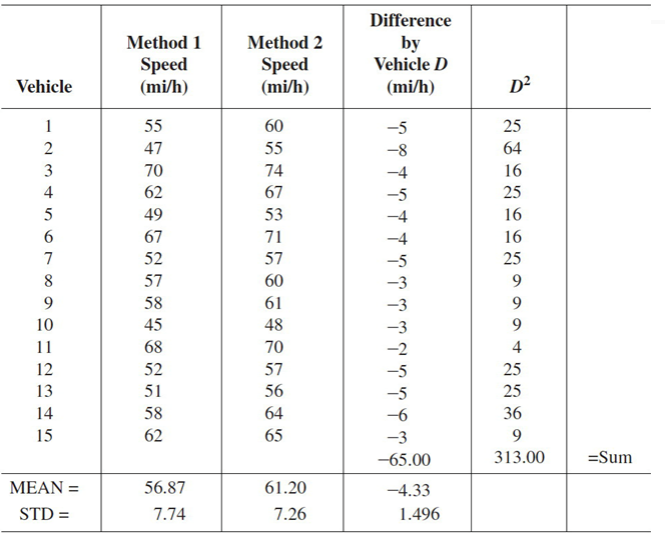
:::

:::

