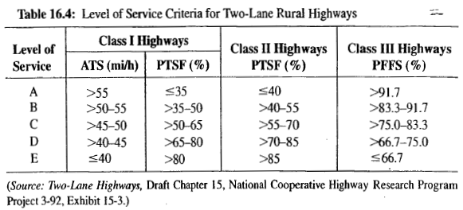

# Rural Two-lane Highway

## Rural 2-lane Hwy: Classes {.smaller}

* **Class I** 
  - Motorists expect to travel at relatively high speeds
  - Major intercity routes, primary arterials, and daily commuter routes.

* **Class II**
  - Motorists do not necessarily expect to travel at high speeds
  - Access routes, scenic and recreational routeis that are not primary arterials, and routes through rugged terrain.

## Rural 2-lane Hwy: LOS Measurement {.smaller}

* **Average Travel Speed (ATS)** 
  - Average speed of all vehicles traversing the defined analysis segment for the specified time period, which is usually the peak 15 minutes of a peak hour.
* **Percent Time Spent Following (PTSF)** 
  - Aggregate percentage of time that all drivers spend in queues, unable to pass, with the speed
restricted by the queue leader.
  - OR, percentage of vehicles following others at headways of 3.0 seconds or less.
* **Percent Free Flow Speed (PFFS)** 
  - Based on the comparison of the prevailing speed to the free-flow speed, expressed as a percentage.

## Rural 2-lane Hwy: LOS Measurement

## Rural 2-lane Hwy: $ATS_d$ {.smaller}

$$ATS_d = FFS_d - 0.00776(\nu_d + \nu_o)-f_{npA}$$

* $ATS_d$ = ATS for direction $d$, mph
* $FFS_d$ = FFS for direction $d$, mph
* $\nu_d$ = Demand Flow rate for direction $d$, pc/h
* $\nu_o$ = Demand FLow rate for direction $o$ opposite to direction $d$, pc/h 
* $f_{npA}$ = adjustment for "No Passing" zones, $\%$

## Rural 2-lane Hwy: $ATS_d$ {.smaller}

$$ATS_d = FFS_d - 0.00776(\nu_d + \nu_o)-f_{npA}$$

- $FFS_d = BFFS - f_{LS} - f_A$
  - $BFFS$ = base FFS for the facility, mph
  - $f_{LS}$ = adj. for lane and shoulder width, mph
  - $f_A$ = adj for access point density, mi/h

## Rural 2-lane Hwy: $ATS_d$ {.smaller}

* For direction $d$, **Demand Flow Rate, $\nu_d$** , pc/h
  - $\nu_d = \frac{V}{PHF \times f_{HV} \times f_G}$
    - $V$ = hourly demand volume under prevailing conditions, veh/h
    - $PHF$: peak hour factor
    - $f_{HV}$: adjustment for heavy vehicle presence
      - $f_{HV} = \frac{1}{1+P_T(E_T-1)+P_R(E_R-1)}$
        - $P_T$ = proportion of trucks and buses in the traffic stream
        - $P_R$ = proportion of recreational vehicles in the traffic stream
        - $E_T$ = passenger-car equivalent for trucks and buses
        - $E_R$ = passenger-car equivalent for recreational vehicles
    - $f_G$: adjustment for grades

## Rural 2-lane Hwy: $PTSF_d$ {.smaller}

$$PTSF_d = BPTSF_d + f_{npA}(\frac{\nu_d}{\nu_d+\nu_o})$$

* $PTSF_d$ = PTSF for direction $d$, $\%$
* $BPTSF_d$ = Base PTSF for direction $d$, $\%$
* $\nu_d$ = Demand Flow rate for direction $d$, pc/h
* $\nu_o$ = Demand FLow rate for direction $o$ opposite to direction $d$, pc/h 
* $f_{npA}$ = adjustment for "No Passing" zones, $\%$

## Rural 2-lane Hwy: $PTSF_d$ {.smaller}

$$PTSF_d = BPTSF_d + f_{npA}(\frac{\nu_d}{\nu_d+\nu_o})$$

* $BPTSF_d$ = Base PTSF for direction $d$, $\%$
  - $BPTSF_d = 100[1- e^{a\nu_{d}^b}]$
    - $a,b$ = calibration constants based on opposing flow rate ($o$) in single-direction analysis

# Sample Problem: Rural Two-lane Highway
## Example Problem {.smaller}
A Class I two-lane highway in rolling terrain has a peak demand volume of 500 veh/h, with 15% trucks and 5% RVs. The highway serves as a main link to a popular recreation area. The directional split of traffic is 60-40 during peak periods, and the peak-hour factor is 0.88. The 10-mile section under study has 40% "No Passing" zones. The base free-flow speed of the facility may be taken to be 60 mi/h. Lane widths are 12 feet, and shoulder widths are 2 feet. There are 10 access points per mile along this 10-mile section.

[Relevant Tables and Figures](images/chap28/chap16TablesFigures.pdf)
[Sample Problem with Steps](images/chap28/chap28LOSRural2laneStepsAndProblem.pdf)

## Example Problem {.smaller}
A Class I two-lane highway in rolling terrain has a peak demand volume of 568 veh/h, with 15% trucks and 5% RVs. The highway serves as a main link to a popular recreation area. The directional split of traffic is 60-40 during peak periods, and the peak-hour factor is 0.88. The 10-mile section under study has 40% "No Passing" zones. The base free-flow speed of the facility may be taken to be 60 mi/h. Lane widths are 12 feet, and shoulder widths are 2 feet. There are 10 access points per mile along this 10-mile section.

::::: {.columns}

::: {.column width="50%"}
* Given that,
  - Class I and Rolling terrain
  - Peak demand vol, $V = 500\ veh/h$
  - Truck %, $P_T = 15%$
  - RV %, $P_R = 5%$
  - PHF = $0.88$
  - Segment length $L = 10\ mile$
  - % "No Passing" zone = $40\%$
:::

::: {.column width="50%"}
- BFFS = $60\ mph$
- Dir. split = $60-40$ during peak period
- Lane width = $12\ feet$
- Shoulder width = $2\ feet$
- access/mile = $10$
:::

:::::

## Solution {.smaller}

$$ATS_d = FFS_d - 0.00776(\nu_d + \nu_o)-f_{npA}$$

- $ATS_1 = FFS_1 - 0.00776(\nu_1 + \nu_2)-f_{npA}$
- $ATS_2 = FFS_2 - 0.00776(\nu_1 + \nu_2)-f_{npA}$

## Solution {.smaller}

**Step 1:** Calculate FFS

::::: {.columns}

::: {.column width="50%"}
* $FFS_d = BFFS - f_{LS} - f_A$
* $FFS_d = 60 - 2.6 - 2.5$
  - $FFS_1 = 54.9\ mph$
  - $FFS_2 = 54.9\ mph$

:::

::: {.column width="50%"}
* $f_{LS} = 2.6$
  - Table 16.5; 12-foot lane, 2-foot shoulder
* $f_{A} = 2.5$
  - Table 16.6; 10 access points per mile
:::

:::::

## Solution {.smaller}

**Step 2:** Calculate the Dir. Demand Flow Rates

* Two lanes analyzed separately
* Demand volumes for 60-40 Split:
  * $V_1 = 568 \times 0.60 = 341\ veh/h$
  * $V_2 = 568 \times 0.40 = 227\ veh/h$

## Solution $ATS_d$ {.smaller}
**Step 2:** Calculate the Dir. Demand Flow Rates

::::: {.columns}

::: {.column width="50%"}
* **<u>Dir. 1________________________</u>**
  - $\nu_d = \frac{V}{PHF \times f_{HV} \times f_G}$
  - $\nu_d = \frac{341}{0.88 \times 0.85 \times 0.86}$
  - $\nu_d = 530\ pc/h$
    

:::

::: {.column width="50%"}
* **<u>Find Values for $f_{HV}$ and $f_G$</u>**
* $f_{HV} = \frac{1}{1+P_T(E_T-1)+P_R(E_R-1)}$
* $f_{HV} = \frac{1}{1+0.15(2.1-1)+0.05(1.1-1)}$
* $f_{HV} = 0.85$
* $f_{G} = 0.86$

:::

:::::

* Factors

| Factor | Dir 1 | Source                                |
|--------|-------|---------------------------------------|
| $f_G$  | 0.86  | Table 16.7: (Rolling; Interpolation)  |
| $E_T$  | 2.1   | Table 16.10: (Rolling; Interpolation) |
| $E_R$  | 1.1   | Table 16.10: (Rolling; Interpolation) |

## Solution $ATS_d$ {.smaller}
**Step 2:** Calculate the Dir. Demand Flow Rates

::::: {.columns}

::: {.column width="50%"}
* **<u>Dir. 2________________________</u>**
  - $\nu_d = \frac{V}{PHF \times f_{HV} \times f_G}$
  - $\nu_d = \frac{227}{0.88 \times 0.83 \times 0.77}$
  - $\nu_d = 404\ pc/h$
    

:::

::: {.column width="50%"}
* **<u>Find Values for $f_{HV}$ and $f_G$</u>**
* $f_{HV} = \frac{1}{1+P_T(E_T-1)+P_R(E_R-1)}$
* $f_{HV} = \frac{1}{1+0.15(2.3-1)+0.05(1.1-1)}$
* $f_{HV} = 0.83$
* $f_{G} = 0.77$

:::

:::::

* Factors

| Factor | Dir 2 | Source                                |
|--------|-------|---------------------------------------|
| $f_G$  | 0.77  | Table 16.7: (Rolling; Interpolation)  |
| $E_T$  | 2.3   | Table 16.10: (Rolling; Interpolation) |
| $E_R$  | 1.1   | Table 16.10: (Rolling; Interpolation) |

## Solution $ATS_d$ {.smaller}

* **Find Values for $f_{npA1}$ and $f_{npA2}$**
  - $f_{npA1} = 1.9$
    - Table 16.15; 40% No passing zone, $\nu_o = 404\ pc/h$
  - $f_{npA2} = 1.4$
    - Table 16.15; 40% No passing zone, $\nu_o = 530\ pc/h$

## Solution $ATS_d$ {.smaller}

**Step 3:** Determine $ATS_d$

* **Dir. 1________________________**
- $ATS_1 = FFS_1 - 0.00776(\nu_1 + \nu_2)-f_{npA1}$
- $ATS_1 = 54.9 - 0.00776(530 + 404)- 1.9$
- $ATS_1 = 45.8\ pc/h$

* **Dir. 2________________________**
- $ATS_1 = FFS_2 - 0.00776(\nu_1 + \nu_2)-f_{npA}$
- $ATS_1 = 54.9 - 0.00776(530 + 404)- 1.4$
- $ATS_1 = 46.3\ pc/h$

## Solution $PTSF_d$ {.smaller}

$$PTSF_d = BPTSF_d + f_{npA}(\frac{\nu_d}{\nu_d+\nu_o})$$
$$BPTSF_d = 100[1- e^{a\nu_{d}^b}]$$

## Solution $PTSF_d$ {.smaller}

* $f_{HV1} = 0.90$ (Table 16.10)
* $f_{HV2} = 0.89$ (Table 16.10)
* $\nu_{1} = 495\ pc/h$ (Table 16.10; Table 16.7)
* $\nu_{2} = 358\ pc/h$ (Table 16.10; Table 16.7)
* $a_{1} = -0.0020$ (Table 16.17; $\nu_{2} = 358\ pc/h$)
* $a_{2} = -0.0027$ (Table 16.17; $\nu_{1} = 495\ pc/h$)
* $b_{1} = 0.934$   (Table 16.17; $\nu_{2} = 358\ pc/h$)
* $b_{2} = 0.920$   (Table 16.17; $\nu_{1} = 495\ pc/h$)
* $f_{npA1} = f_{npA2} = 32.4\%$ (Table 16.16)

## Solution $PTSF_d$ {.smaller}
$$PTSF_d = BPTSF_d + f_{npA}(\frac{\nu_d}{\nu_d+\nu_o})$$

::::: {.columns}

::: {.column width="50%"}
* $BPTSF_d = 100[1- e^{a\nu_{d}^b}]$
* $BPTSF_1 = 100[1- e^{a_{1} \nu_{1}^{b_1}}]$
* $BPTSF_1 = 100[1- e^{-0.0020 \times 495^{0.934}}]$
* $BPTSF_1 = 48.2\%$
:::

::: {.column width="50%"}
* $BPTSF_d = 100[1- e^{a\nu_{d}^b}]$
* $BPTSF_2 = 100[1- e^{a_{2} \nu_{2}^{b_2}}]$
* $BPTSF_2 = 100[1- e^{-0.0027 \times 358^{0.920}}]$
* $BPTSF_2 = 45.3\%$

:::

:::::

## Solution $PTSF_d$ {.smaller}

* Direction 1
  * $PTSF_d = BPTSF_d + f_{npA}(\frac{\nu_d}{\nu_d+\nu_o})$
  * $PTSF_1 = BPTSF_1 + f_{npA1}(\frac{\nu_1}{\nu_1+\nu_2})$
  * $PTSF_1 = 48.2 + 32.4(\frac{495}{495+358})$
  * $PTSF_1 = 67\%$

* Direction 2
  * $PTSF_d = BPTSF_d + f_{npA}(\frac{\nu_d}{\nu_d+\nu_o})$
  * $PTSF_2 = BPTSF_2 + f_{npA2}(\frac{\nu_2}{\nu_1+\nu_2})$
  * $PTSF_2 = 45.3 + 32.4(\frac{495}{495+358})$
  * $PTSF_2 = 58.9\%$
  
## Solution $LOS$ {.smaller}

* Table 16.4

| Dir, $d$  | $ATS_d$ | $PTSF_d$  |  LOS |
|-----------|---------|-----------|------|
| $1$       | 45.8    |  67.0%    |   C  |
| $2$       | 46.3    |  58.9%    |   C  |
