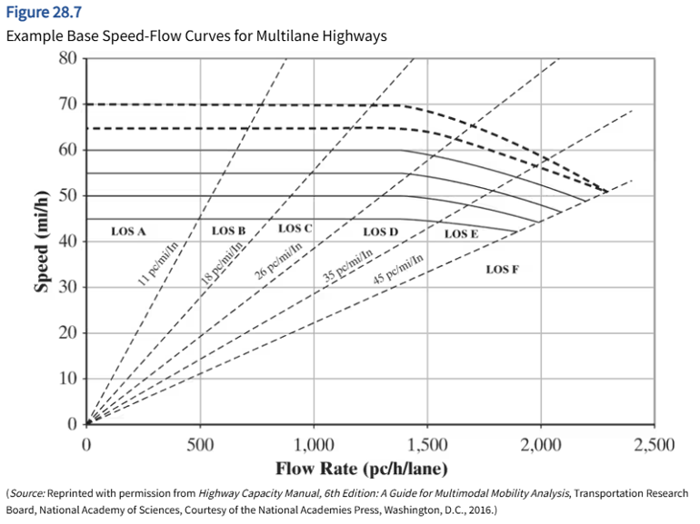

## LOS Analysis by Facility Type

* [Freeway](ch28LOS_Freeway.qmd)
* [Multilane Highways](ch28LOS_MultilaneHighway.qmd)
* [Rural Two-lane Highways](ch28LOS_RuralTwo-laneHwy.qmd)

## Service 
* Facilities provide service to road users

## Type of Analysis {.smaller}

* 1. Operational Analysis
  - Given, existing or forecast demand volume
  - Find expected LOS and operating parameters
* 2. Design Analysis
  - Given, all traffic, roadway, and control conditions for an existing or projected highway section
  - Find number of lanesf for a specified LOS
* 3. Service Flow Rate and Service Volume Analysis

## Operational Analysis

* $q=ku$
* 

## LOS Analysis by Facility Type

* [Freeway](ch28LOS_Freeway.qmd)
* [Multilane Highways](ch28LOS_MultilaneHighway.qmd)
* [Rural Two-lane Highways](ch28LOS_RuralTwo-laneHwy.qmd)