## Class Logistics

* HW1 will assigned next week
* Groups and Project will be assigned next week
* 

## TOPICS

* **Ch. 3: Horizontal Design of Roadway**
  - Hor. Curve Alignments
  - Hor. Curve Equations
  - Superelevation
  - Min. Radius of Curve
  - Stopping Sight Distance (SSD) on the curve

## Arc and Chord Definition

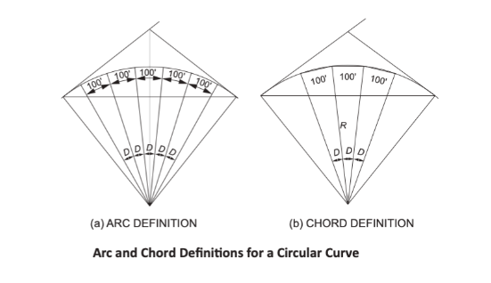{fig-align="center"}

* *Degree of curvature*: the central angle (D) to the ends of an agreed length (i.e. 100 ft) of either an arc or a chord.

## Stationing

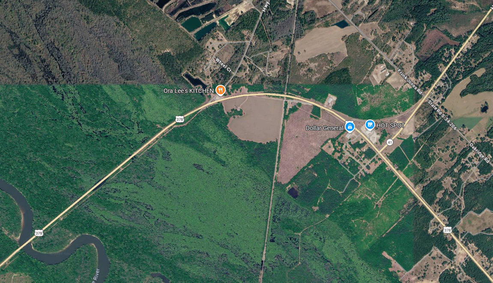{fig-align="center"}

## Horizontal Curve Alignments

:::: {.columns}

::: {.column width="50%"}
* Objectives:
  - Provide a transition between two straight (tangent) sections.
* Things to consider
  - speed, side friction, superelevation, etc.
  - Severity (tight/gentle) measured by the degree of curvature
:::

::: {.column width="50%"}

:::

::::

## Hor. Curve Equations
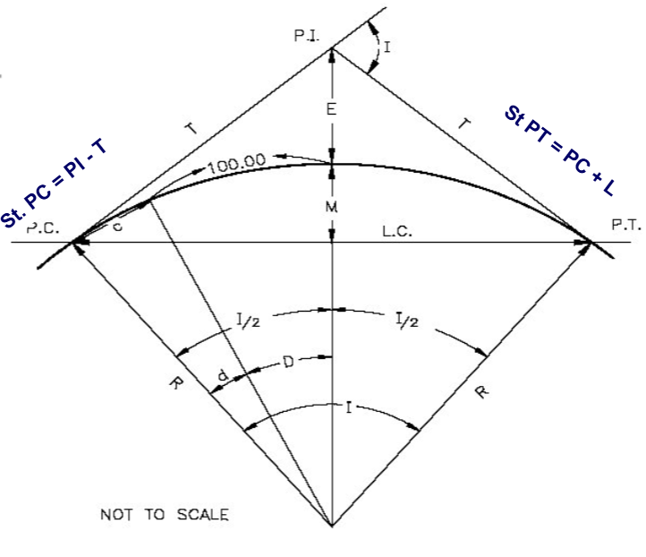{fig-align="center"}

## Hor. Curve Equations

:::: {.columns}

::: {.column width="60%"}

:::

::: {.column width="40%"}

:::

::::

## Hor. Curve Equations
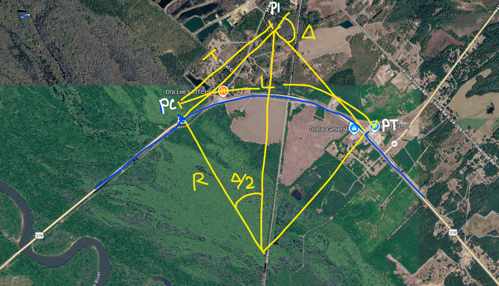{fig-align="center"}

## Hor. Curve Equations

:::: {.columns}

::: {.column width="30%"}
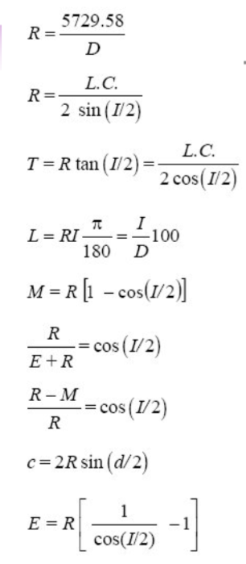
:::

::: {.column width="70%"}

:::

::::

## Hor. Curve Eq. : Problem

:::: {.columns}

::: {.column width="40%"}
Two tangent lines meet at station 32 + 15. The radius of curvature is 1200 feet, and the
angle of deflection is 14 degrees. Find the length of the curve, the stations for the PC and PT and all other relevant characteristics of the curve (LC, M, E).
:::

::: {.column width="60%"}
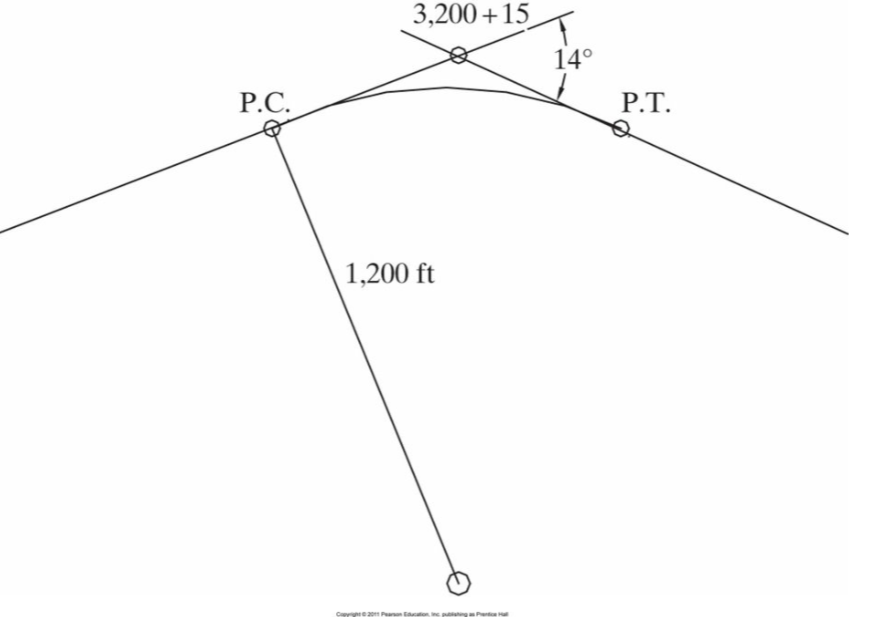
:::

::::

## SSD on Curve
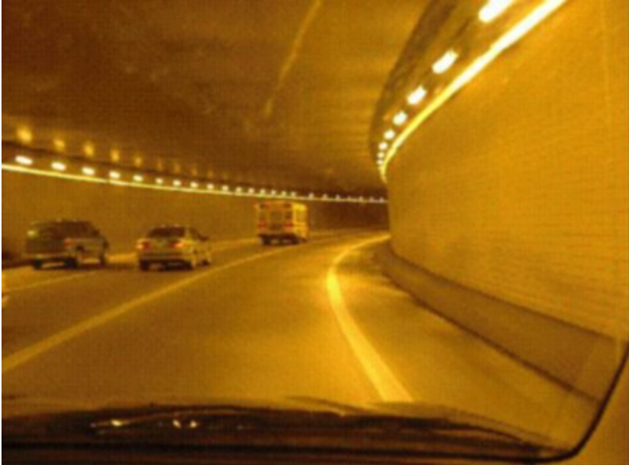

## SSD on Curve

* Sight distance restrictions on horizontal curves occur when there is an obstruction (e.g., buildings, rock outcroppings) located close to the road.
* A minimum of sight distance equal to the safe stopping distance must be provided at every point along the roadway.

## SSD on Curve
:::: {.columns}

::: {.column width="40%"}
* When such an obstruction exists, the stopping-sight distance is measured along the horizontal curve from the center of the traveled lane (the assumed location of the driver’s eyes).
:::

::: {.column width="60%"}
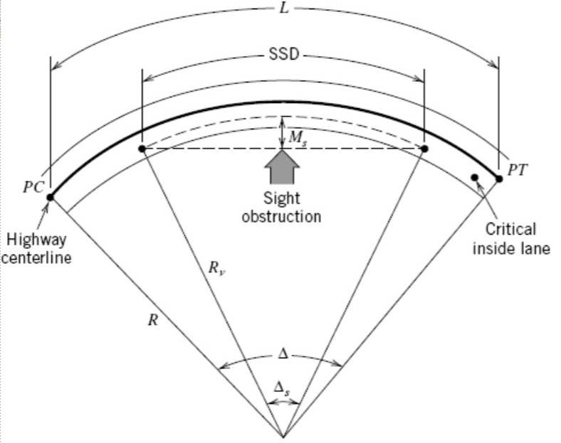
:::

::::

## SSD on Curve
:::: {.columns}

::: {.column width="40%"}
* for a specified stopping distance, some distance, Ms (the middle ordinate of a curve that
has an arc length equal to the stopping sight distance), must be visually cleared so that the line of sight is such that sufficient stopping-sight distance is available.
:::

::: {.column width="60%"}

:::

::::

## SSD on Curve
:::: {.columns}

::: {.column width="60%"}
* $d_{ssd}=1.47S_i t + \frac{S_i^2 - S_f^2}{30(F \pm G)}$
* Design Stds:
  - $F=0.348$
* $M_{s}=R_v(1- cos \frac{90d_{ssd}}{\pi R_v})$
  - $R_v = \frac{5729.58}{D_v}$

:::

::: {.column width="40%"}

:::

::::

## SSD on Curve: Problem

:::: {.columns}

::: {.column width="60%"}
A 6 degree curve (measured at the centerline of the inside lane) is being designed for a highway with a design speed of 70 mi/hr. The grade is level, and driver reaction time is 2.5 seconds. What is the closest any roadside object may be placed to the centerline of the inside lane of the roadway?
:::

::: {.column width="40%"}

:::

::::

. . . 

* $d_{ssd}=1.47 \times 70 \times 2.5 + \frac{70^2 - 0^2}{30(0.348 \pm 0)}$
* $d_{ssd}=726.6 ft$

For a SSD of $726.6ft$, the min clearance at roadside:

* $M_{s}= R_v(1- cos \frac{90d_{ssd}}{\pi R_v})$
* $M_{s}= \frac{5729.58}{6} \times (1- cos \frac{90 \times 726.26}{\pi \frac{5729.58}{6}})$
* $M_{s}= 68.3 ft$

## Superelevation
Amount by which the outer edge of a curve on a road or railroad is banked above the inner edge.
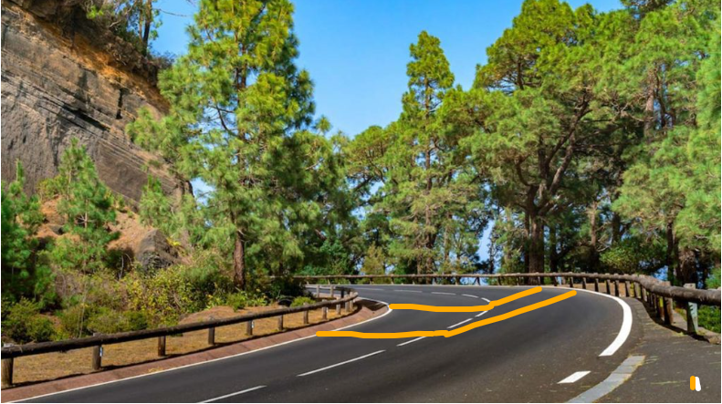

## Superelevation: Why?

:::: {.columns}

::: {.column width="50%"}
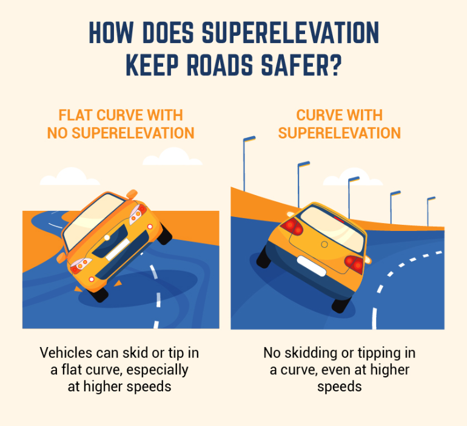
:::

::: {.column width="50%"}
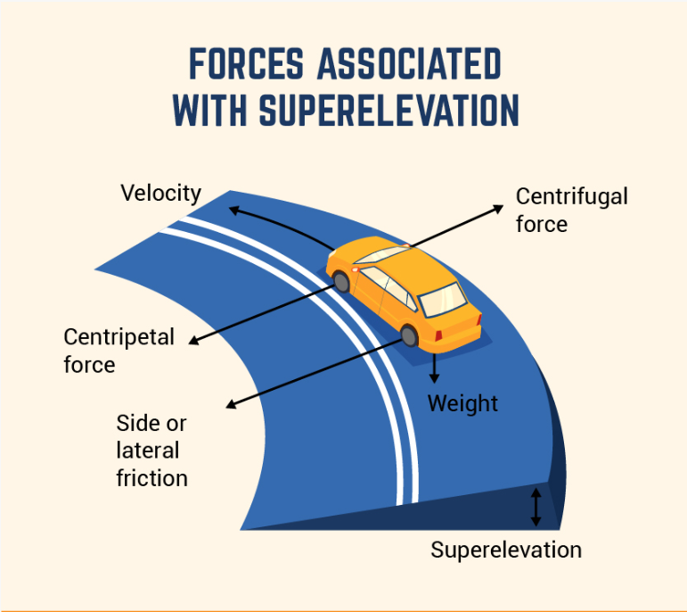
:::

::::

::: {style="font-size: 0.30em;"}
https://www.bigrentz.com/blog/superelevation
:::

## Superelevation: Components

:::: {.columns}

::: {.column width="50%"}
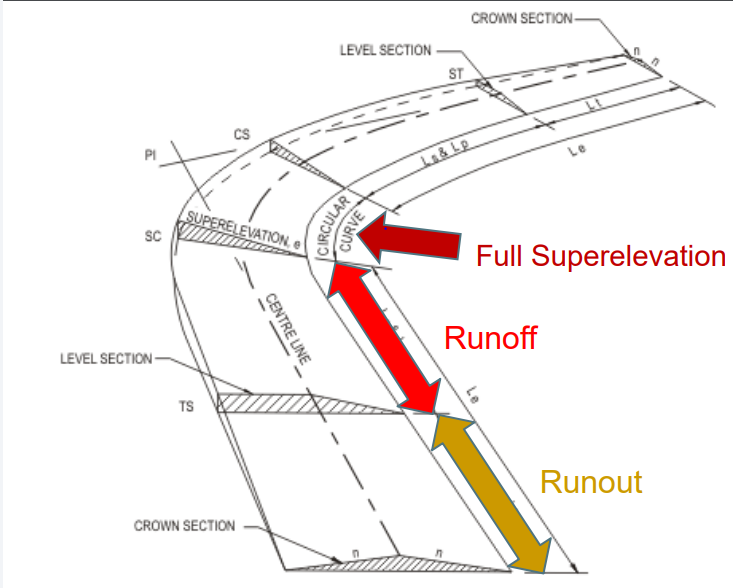
:::

::: {.column width="50%"}
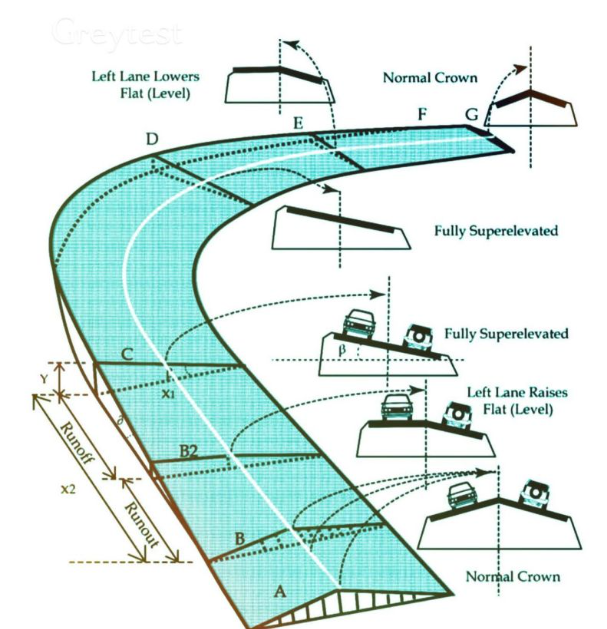
:::

::::

## Superelevation: Change of XS

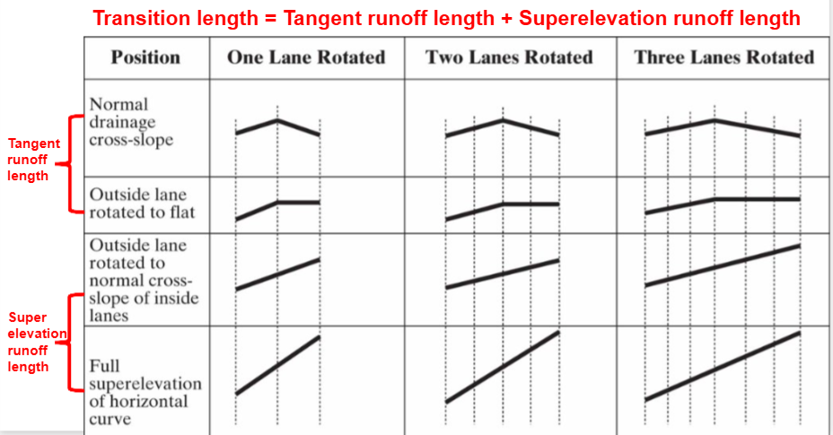

## Superelevation: Eq. for Runoff length
:::: {.columns}

::: {.column width="60%"}
$L_r = \frac{w \times n \times e_d \times b_w}{\Delta}$    

* $L_r$ = minimum length of superelevation runoff, ft
* $w$ = width of lane, ft
* $n$ = number of lanes being rotated (i.e. lanes in one direction)
* $e_d$ = design superelevation rate, expressed as a decimal
* $b_w$ = adjustment factor for number of lanes rotated 
* - 1: for one lane, 0.75 for two, 0.67 for three
* $\Delta$ = maximum relative gradient, (Table 27.3) expressed as a decimal

:::

::: {.column width="40%"}

:::

::::

## Superelevation: Eq. for Runoff length

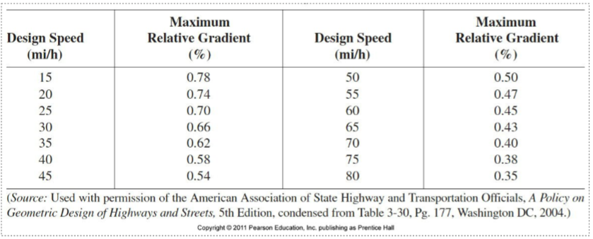

## Superelevation: Eq. for Tangent Runoff

:::: {.columns}

::: {.column width="60%"}
$L_t = \frac{e_{NC}}{e_d} \times L_r$    

* $L_t$ = length of tangent runoff, ft
* $L_r$ = length of superelevation runoff, ft
* $e_{NC}$ = normal cross-slope, % (for drainage)
* $e_d$ = design superelevation rate, %

:::

::: {.column width="40%"}

:::
::::

## Superelevation: Sample Problem

A four-lane highway with a superelvation rate of 0.04 achieved by rotating two 12 ft lanes around the centerline. The normal drainage cross-slope is 0.01. The design speed of the highway is 60 mi/h. What is the appropriate minimum length of superelevation runoff and what is the tangent runoff length.