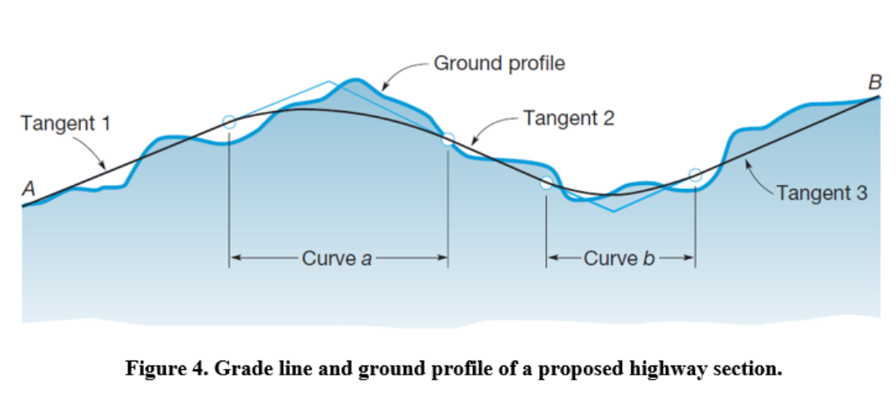
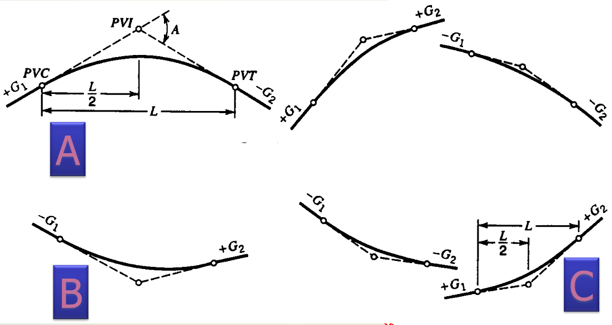
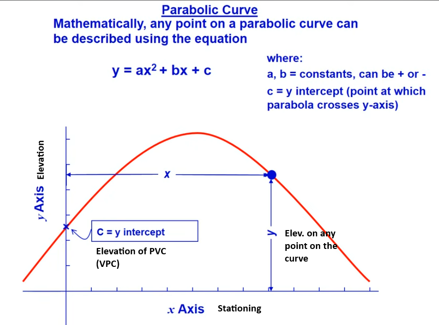
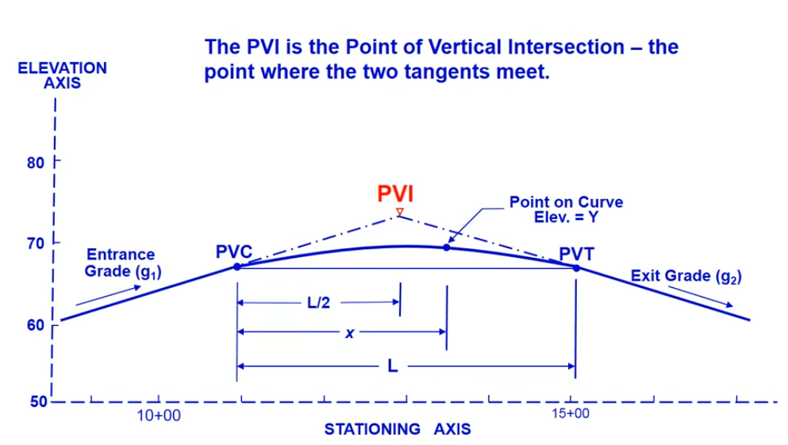
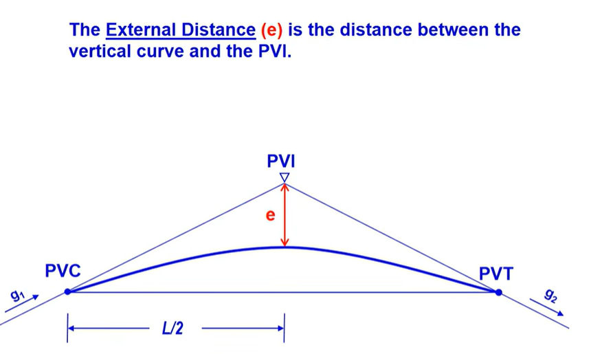

## TOPICS

* **"Ch. 3: Vertical Design of Roadway"**
  - Ver. Curve Alignments / Types
  - Ver. Curve Equations
  - Stopping Sight Distance (SSD) on the curve
  - Min. Length of Curve

## Vertical Alignment of Highways
{fig-align="center"}

## Ver. Curve: Types

* Crest Ver. curve
  - Entry tangent greater than Exit tangent($G_1 > G_2$)
* Sag Ver curve
  - Entry tangent less than Exit tangent($G_1 < G_2$)

## Ver. Curve: Types

Identify the the type of vertical curve in A, B, and C?

{fig-align="center"}

## Ver. Curve: Equation

* Symmetrical parabolic curve is used for vertical curves
* $y=ax^2+bx+c$

{fig-align="center"}

::: {style="font-size: 0.30em;"}
[Daniel Findley Youtube Channel](https://www.youtube.com/watch?v=qZVZyf_9r2k)
:::

## Ver. Curve: Equation

:::: {.columns}

::: {.column width="50%"}

:::

::: {.column width="50%"}

:::

::::

::: {style="font-size: 0.30em;"}
[Daniel Findley Youtube Channel](https://www.youtube.com/watch?v=qZVZyf_9r2k)
:::

## Ver. Curve: Equation

:::: {.columns}

::: {.column width="60%"}

* $Y=ax^2+bx+c$
  - $Y$ = elev. of any point on the curve
  - $x$ = distance along stationing from PVC (VPC)
  - $a = \frac{g_2-g_1}{2L}$
  - $b = g_1$ = entrance grade
  - $c$ = elev. of PVC (VPC) = elev. of PVI (VPI) - $g_1 - \frac{L}{2}$
  - $L$ = length of curve
  
  
:::

::: {.column width="40%"}

:::

::::

## Ver. Curve: Special Points
:::: {.columns}

::: {.column width="60%"}

* $y$ (lowercase) = $ax^2$ = tangent offset 
* External Distance (e): between PVI and vertical curve
  - $x=\frac{L}{2}$
  - $y=ax^2 = a (\frac{L}{2})^2$
  - $y=ax^2 = \frac{g_2-g_1}{2L}(\frac{L}{2})^2$
  - $y=ax^2 = \frac{g_2-g_1}{2L}(\frac{L^2}{4})$
  - $y=ax^2 = \frac{g_2-g_1}{8}(L)$
  - $y=ax^2 = \frac{AL}{8}$

:::

::: {.column width="40%"}

:::

::::

## Ver. Curve: Special Points

* $Y=ax^2+bx+c$
* For High/Low point on the curve $\frac{dY}{dx} = 0$
  - $\frac{d}{dx}(ax^2+bx+c) = 0$
  - $2ax+b = 0$
  - $x_{high/low} = \frac{-b}{2a}$
  - $x_{high/low} = \frac{-g_1}{2 \frac{g_2-g_1}{2L}}$
  - $x_{high/low} = \frac{-g_1L}{g_2-g_1}$

## Ver. Curve: Problem
A vertical curve of 600 feet connects a +4% grade to a -2% grade. The elevation of the PVC is 1250 ft.  Find the elevation of the PVI, the PVT and the high point?

## Ver. Curve: SSD

* available sight distance ≥ required stopping sight distance S
* driver’s sight line just “grazes” the parabolic curve.  CREST curve
* Sight distance limited by headlamp range.  SAG curve

## Ver. Curve: SSD
::: {style="color: blue;"}
**Min. Length ($L_{min}$)**
:::

* <u>Driver and object both on the ver curve</u> ($d_{ssd} < L$)
  - $L_{min} = \frac{|g_2 - g_1| \times d_{ssd}^2}{2158}$   CREST curve
  - $L_{min} = \frac{|g_2 - g_1| \times d_{ssd}^2}{400+3.5d_{ssd}}$  SAG curve
* <u>sight distance extends beyond the curve onto a tangent</u> $d_{ssd} > L$
  - $L_{min} = 2d_{ssd} - \frac{2158}{|g_2 - g_1|}$  CREST curve
  - $L_{min} = 2d_{ssd} - (\frac{400+3.5d_{ssd}}{|g_2 - g_1|})$   SAG curve
  
## Ver. Curve: SSD Problem
What is the min length of vertical curve that must be provided to connect a 5% grade with a 2% grade on a highway with design speed of 60 mph?
  

