<!-- # Class Logistics -->

<!-- ## Announcements -->

<!-- ## Reminders -->

<!-- * Homework #1 is due today -->

# Traffic Control Devices

## Traffic Control Devices
- Show a image and identity

## Traffic Control Devices

* Purpose
  - “To promote highway safety and efficiency by providing for orderly movement of all road users on streets and highways, bikeways, public facilities, and private property open to public travel throughout the Nation.”

## MUTCD

* MUTCD:
  - Manual on Uniform Traffic Control Devices
  - principal standard governing the application, design, and placement of traffic control devices
  - minimum standard and a model for individual state MUTCDs.
  - Latest Edition: [MUTCD 11th Ed.](https://mutcd.fhwa.dot.gov/kno_11th_Editionr1.htm)
* Many states simply adopt the federal manual by statute (e.g. SC). Others develop their own manuals (e.g. TX, CA)

## MUTCD: Principles {.smaller}

Must: 

* Fulfill a need
  - Superfluous devices should not be used. A installed device must be needed for safe and efficient flow of traffic.
* Command attention
  - Attracting a driver’s attention requires proper visibility and a distinctive design.
* Convey a clear, simple message
  - Clarity and simplicity of message is critical since the device is seen for only a few seconds.
* Command respect of road users  
  - Drivers are conditioned to expect meaningful and important messages.
* Give adequate time for a proper response
  - Example, a stop sign should be placed at the stop line and be visible from at least one SSD.

## MUTCD: Contents

* Physical design
  - Detailed standards for shape, size, colors, legend types and sizes, and specific legend.
* Placement / Location
  - Detailed standards and guidelines on where devices should be located with
respect to the traveled way.
* Selection of Devices
  - Warrants or conditions that justify the use of a particular device.

## MUTCD: Legal Aspects {.smaller}

| Type     | Enforcement                                          | Word                                       |
|----------|------------------------------------------------------|--------------------------------------------|
| Standard | Required, mandatory, specifically prohibitive        | "shall" or "shall not"                     |
| Guidance | Recommended; departure needs justification           | "should" or "should not"                   |
| Option   | Permitted; engineering judgment may be used          | "may" or "may not"                         |
| Support  | Explanation, examples, or background                 | statement without "shall", "should", "may" |

## MUTCD: How to Read

:::: {.columns}

::: {.column}
<!-- left column -->
### Example

* [Section]{style="color: #6C88C4;"} [4]{style="color: #FF5C77;"}[D]{style="color: #4DD091;"}.[08]{style="color: #6C88C4;"}, [Par.1]{style="color: #FFA23A;"}, [A.1]{style="color: #74737A;"}

* Item A.1 of Paragraph 1 of Section 4D.08.

:::

::: {.column}
<!-- right column -->
::: pyramid
::: {.item color="#74737A"}
ITEMS
:::
::: {.item color="#FFA23A"}
PARAGRAPH   numbered
:::
::: {.item color="#6C88C4"}
SECTION   numbered 
:::
::: {.item color="#4DD091"}
CHAPTER   letter: A-Z
:::
::: {.item color="#FF5C77"}
PARTS   numbered: 1-9
:::
:::

:::

::::

## MUTCD: How to Read ...

:::: {.columns}

::: {.column}
<!-- left column -->
### Example

* [Section]{style="color: #6C88C4;"} [4]{style="color: #FF5C77;"}[D]{style="color: #4DD091;"}.[08]{style="color: #6C88C4;"}, [Par.1]{style="color: #FFA23A;"}, [A.1]{style="color: #74737A;"}

* Item A.1 of Paragraph 1 of Section 4D.08.

:::

::: {.column}
<!-- right column -->
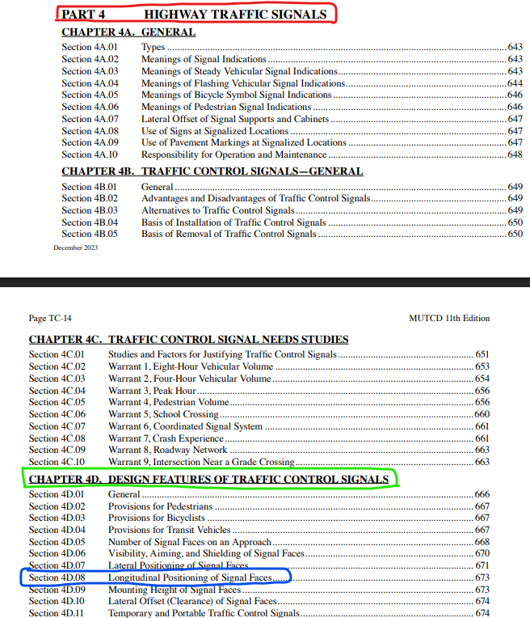

:::

::::

## MUTCD: How to Read ...

:::: {.columns}

::: {.column}
<!-- left column -->
### Example

* [Section]{style="color: #6C88C4;"} [4]{style="color: #FF5C77;"}[D]{style="color: #4DD091;"}.[08]{style="color: #6C88C4;"}, [Par.1]{style="color: #FFA23A;"}, [A.1]{style="color: #74737A;"}

* Item A.1 of Paragraph 1 of Section 4D.08.
  - "No less than 40 feet beyond the stop line, and"

:::

::: {.column}
<!-- right column -->
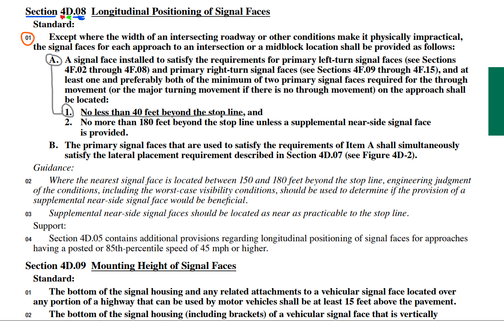

:::

::::

# MUTCD Part

| MUTCD part | Main content                         |
| ---------- | ------------------------------------ |
| **Part 1** | General principles and definitions   |
| **Part 2** | Signs                                |
| **Part 3** | Markings                             |
| **Part 4** | Highway traffic signals              |
| **Part 6** | Temporary traffic control/work zones |

# Traffic Markings

## Traffic Markings: Types {.smaller}

* Longitudinal markings
  - Placed parallel to the direction of travel
  - centerlines, lane lines, and pavement edge lines
* Transverse markings 
  - Placed perpendicular to the direction of travel 
  - Stop and Yield lines
* Crosswalk Markings 
* Object Markers
  - Used to denote obstructions either in or  adjacent to the traveled way.
* Delineators
  - Delineators are reflective devices mounted at a 4-ft height on the sides of a
roadway to help denote its alignment.

## Traffic Markings: Example

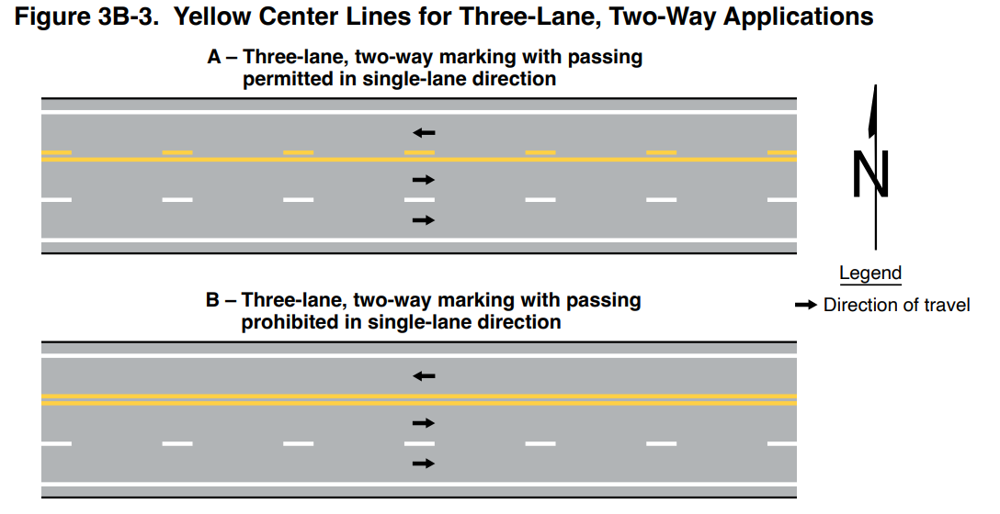

## Traffic Markings: Example

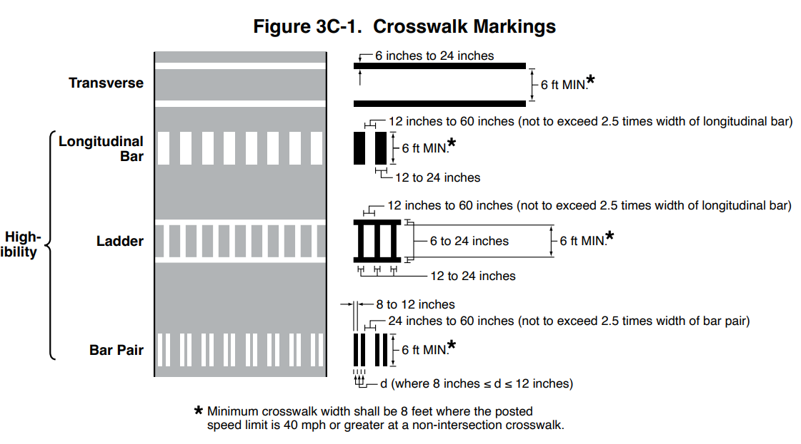

# Traffic Signs

## Traffic Signs: Classification

* Regulatory
  -  give notice of traffic laws or regulations.
* Warning
  - give notice of a situation that might not be readily apparent.
* Guide
  - provide information to road users concerning destinations, available services, and historical/recreational facilities.

# Traffic Signs: Regulatory

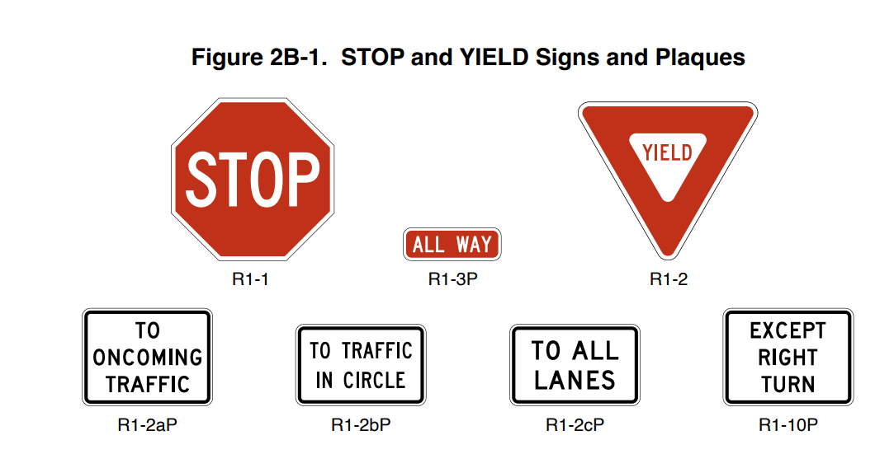

# Traffic Signs: Regulatory

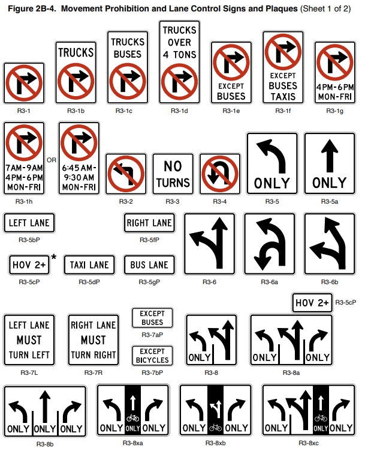

# Traffic Signs: Regulatory

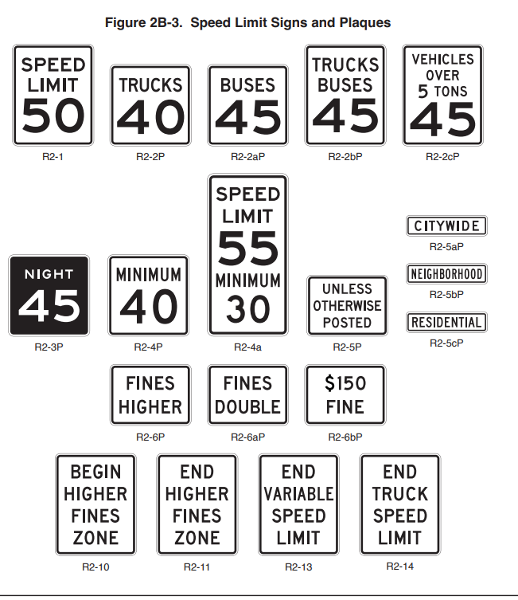

# Traffic Signs: Warning

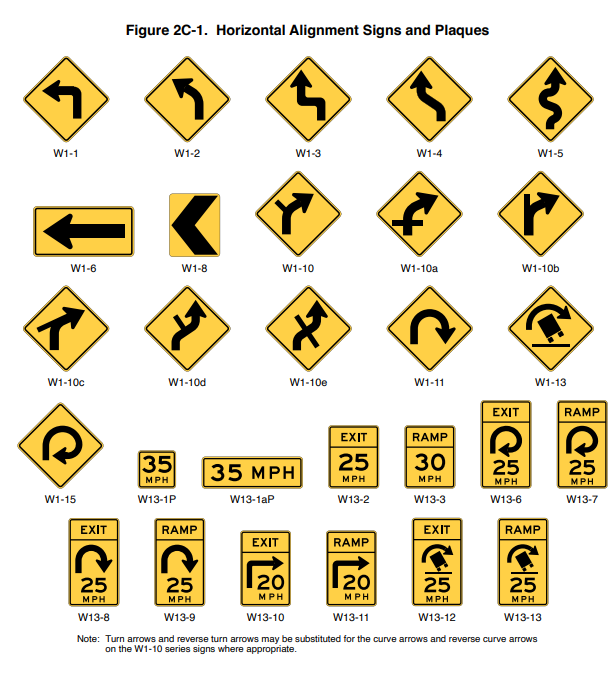

# Traffic Signs: Warning

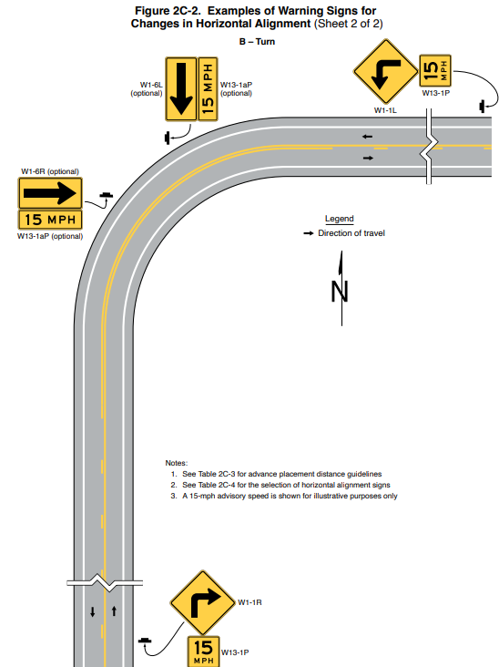

# Traffic Signs: Warning

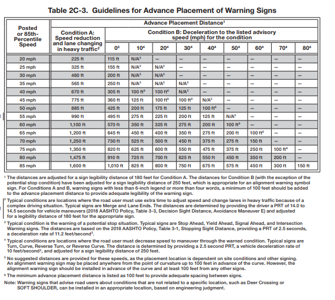

# Traffic Signs: Guide

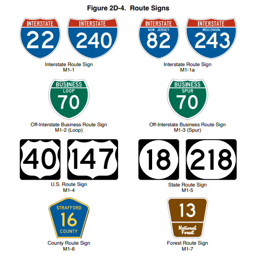

# Traffic Signs: Guide

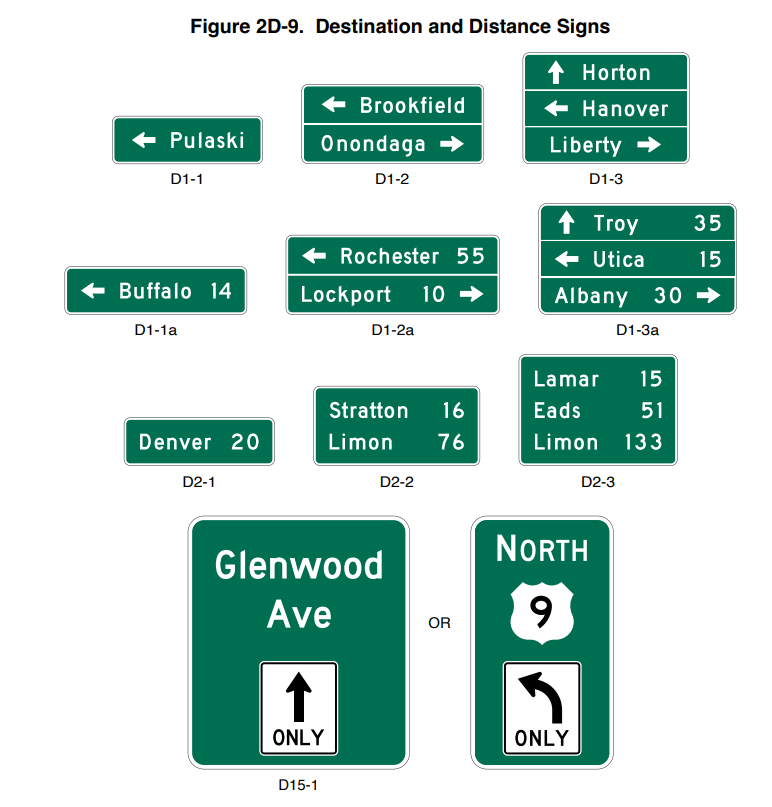

# Traffic Signals

## Traffic Signals: Classification

The MUTCD defines nine types of traffic signals:  
* Pedestrian signals  
* Emergency vehicle traffic control signals  
* Traffic control signals for one-lane, two-way facilities  
* Traffic control signals for freeway entrance ramps  
* Traffic control signals for movable bridges  
* Lane-use control signals  
* Flashing beacons  
* In-roadway lights  

## Traffic Signals: Example

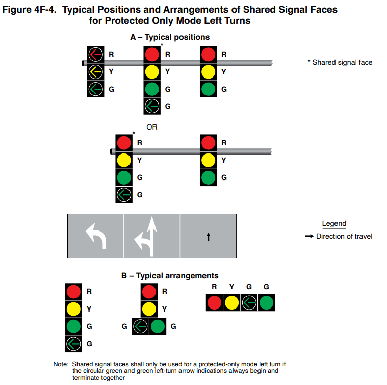

## Traffic Signals: Example

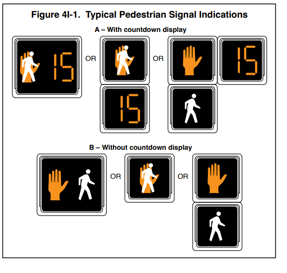

## QUIZ Rules

* Read the entire question before teams may buzz.
* Correct answer: 2 points.
* Correct answer plus a brief reason: 3 points.
* Incorrect answer: no points; that team is locked out, and another team may buzz.

# MUTCD: QUIZ

## MUTCD Q1:   What is the primary purpose of the MUTCD?{.quiz-question}
<!-- {width="600" height="300" fig-align="center"} -->
- To calculate roadway capacity
- [To standardize traffic control devices]{.correct}
- To determine pavement thickness
- To design horizontal curves

## MUTCD Q2:   Which MUTCD Part contains pavement-marking provisions?{.quiz-question}

- Part 1
- Part 2
- [Part 3]{.correct}
- Part 4

## MUTCD Q3:   In the MUTCD, what does the word “shall” mean?{.quiz-question}
- [Required]{.correct}
- Recommended
- Optional
- Informational only

## MUTCD Q4:   Which MUTCD Part should an engineer consult first for a work-zone traffic-control question?{.quiz-question}
- Part 2 — Signs
- Part 3 — Markings
- Part 4 — Signals
- [Part 6 — Temporary Traffic Control]{.correct}
