## Class Logistics (09/02/2026)

* Update Chapter Number in lecture slides
  - 5th Edition: Chapter 27 Geometric Design
* Revised HW 1 posted on BlackBoard
* Course Project
  - Team members assigned
  - Tech Memo #1 uploaded

## Traffic Stream Characteristics 

* To analyze, evaluate, and plan improvementprojects, traffic engineers need a set of variables to describe traffic streams in quantitative terms.
* <u>Macroscopic variables</u>:
  - Volume
  - Flow
  - Speed
  - Density and Occupancy
* <u>Microscopic variables</u>:
  - Headway
  - Spacing

## Volume and Rate of Flow

* **Purpose**:
  - trends over time
  - general planning purposes
* **Traffic Volume, $V$**: 
  - number of vehicles passing a point on a highway, or a given lane or direction of a highway, during a specified time interval.
* **Traffic Flow, $q$**: 
  - number of vehicles passing a point on a highway, or a given lane or direction of a highway, during a specified time interval.
  - $q = \frac{n}{t}$

* **Unit**: 
  - vehicles or **vehicles per unit time (veh/hour): Rate of Flow**

## Volume and Rate of Flow...

* Daily Volumes
  - Average Annual Daily (AADT)
  - Average Annual Weekday (AAWT)
  - Average Daily Traffic (ADT)
  - Average Weekly Traffic (AWT)
* Hourly Volumes
  - Peak-hour volume
  - Directional Design Hour Volume
* Sub-hourly Volumes
  - PHF

## Daily Volumes/Flow

- Daily Volume or Flow: Vehicles per day 

| Defn       | Space          | Count Period, *t*                       | Formula                            |
|------------|----------------|-----------------------------------------|------------------------------------|
| **AADT**:  | Given location | 365-day or 1 year                       | $\frac{n}{t=365}$                  |
| **AAWT**:  | Given location | weekdays over a full 365-year           | $\frac{n}{t=260}$                  |
| **ADT** :  | Given location | less than one year                      | $\frac{n}{t<365}$                  |
| **AWT** :  | Given location | weekdays and less than one year (month) | $\frac{n}{t\ weekdays\ and\ <365}$ |

## Daily Volumes: Problem

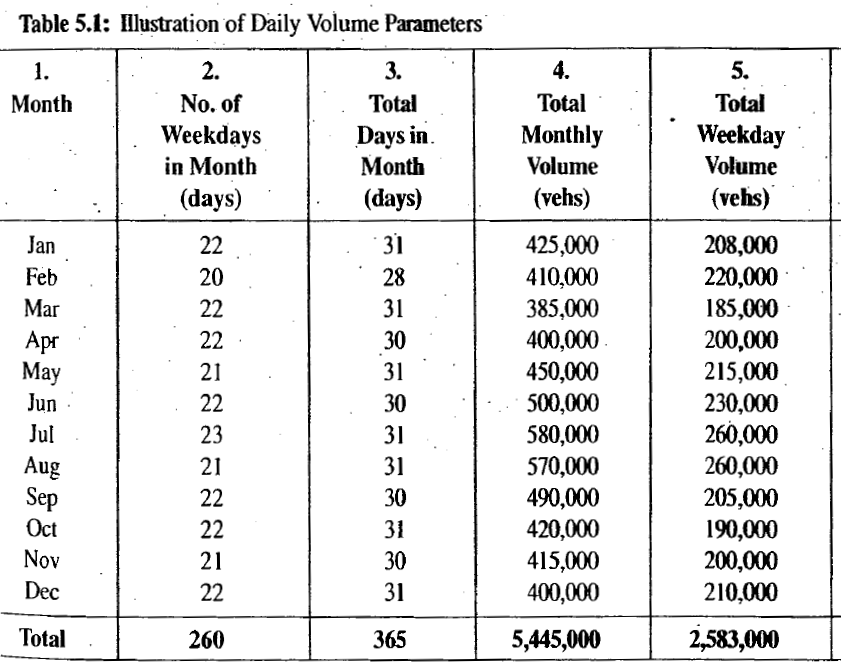{fig-align="center"}

## Daily Volumes: AWT

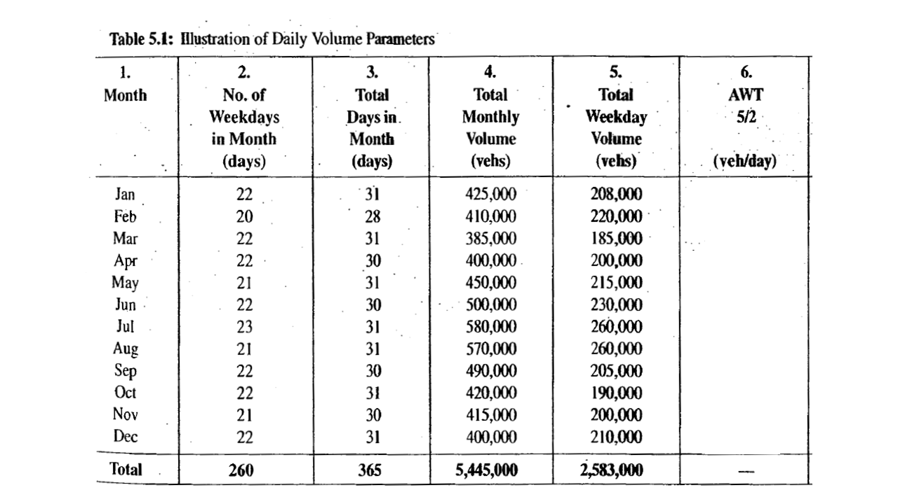{fig-align="center"}

## Daily Volumes: AWT

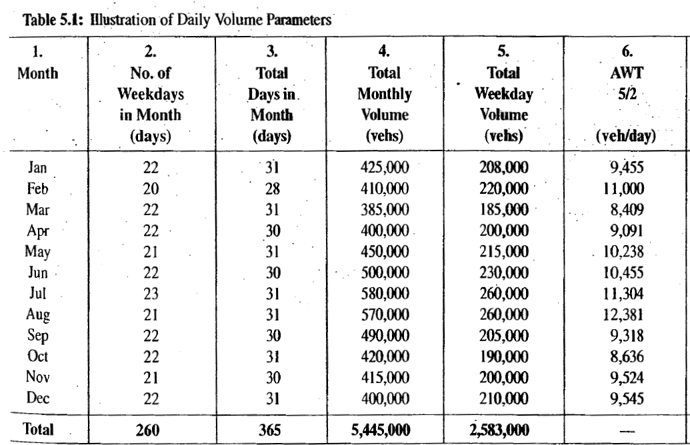{fig-align="center"}

## Daily Volumes: ADT

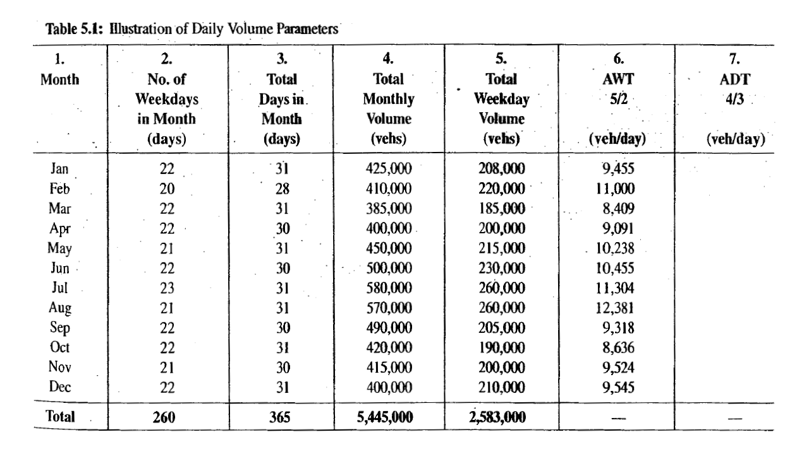{fig-align="center"}

## Daily Volumes: ADT

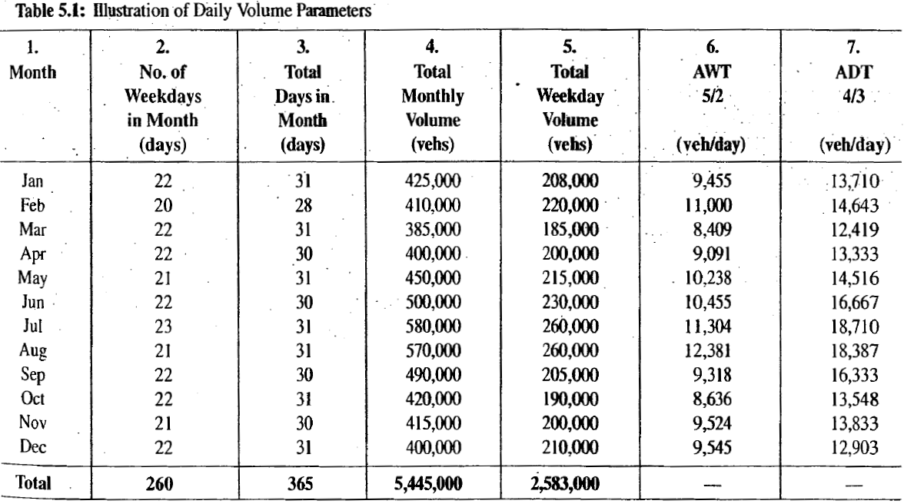{fig-align="center"}

## Daily Volumes: AADT

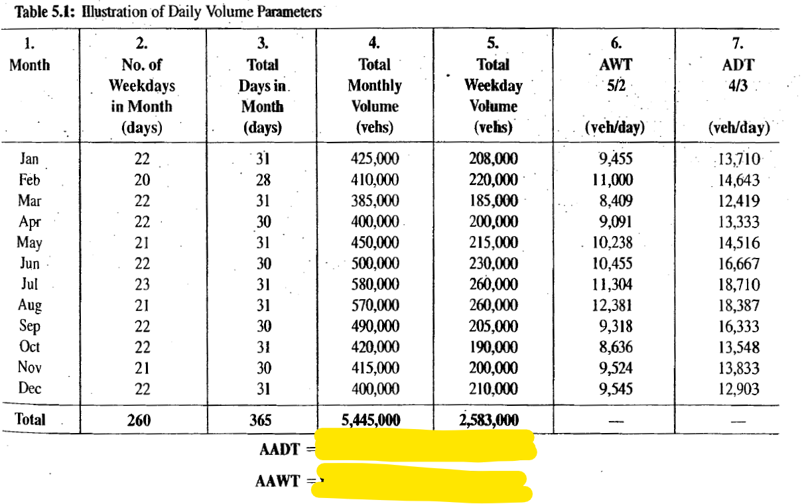{fig-align="center"}

## Daily Volumes: AADT

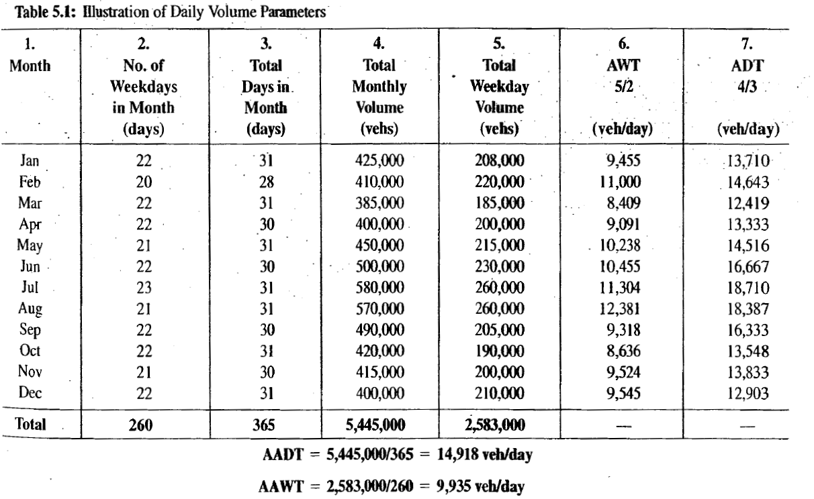{fig-align="center"}

## Hourly Volumes
* Volume varies considerably over the 24 hours of the day, with periods of maximum flow occurring during the morning and evening commuter **"rush hours."**
* **Peak hour**: The single hour of the day that has the highest hourly volume is referred to as the peak hour.
* **Peak-hour Traffic Volume**: Traffic Volume in the peak hour
  - peak-hour traffic volume depends on direction of flow: "Morning Peak" and "Evening Peak" 

## Hourly Volumes: Peak-hour volumes

* AADTs are converted to a peak-hour volume in the peak direction of flow.
* Directional Design Peak Hour (DDHV)
  - $DDHV= AADT \times K \times D$
  - $K$ = proportion of daily traffic occurring during the peak hour
  - $D$ = proportion of peak hour trafic traveling in the peak direction of flow.
  
## Peak-hour volumes ...
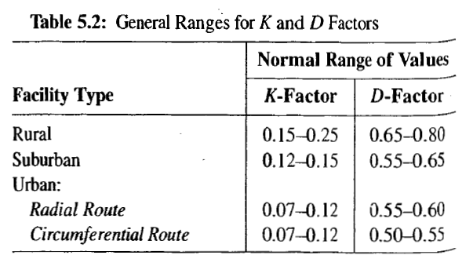{fig-align="center"}

## Peak-hour volumes: Problem
Consider the case of a rural highway that has a 20-year' forecast of AADT of 30,000 veh/day. Based on the data of Table 5.2, what range of directional design hour volumes might be expected for this situation?

## Peak-hour volumes: Problem

:::: {.columns}

::: {.column width="50%"}
Consider the case of a rural highway that has a 20-year' forecast of AADT of 30,000 veh/day. Based on the data of Table 5.2, what range of directional design hour volumes might be expected for this situation?
:::

::: {.column width="40%"}
{fig-align="center"}
:::

::::

. . .

### Solution
* $K = (0.15 -0.25)$
* $D = (0.65-0.80)$
 
* $DDHV_{low} = AADT \times K \times D$
* $DDHV_{low} = 30,000 \times 0.15 \times 0.65 = 2,2925$ veh/hour
* $DDHV_{low} = 2,2925 veh/hour$
 
 
* $DDHV_{low} = AADT \times K \times D$
* $DDHV_{low} = 30,000 \times 0.25 \times 0.85$
* $DDHV_{low} = 6,000$ veh/hour

## Sub-Hourly Volumes
- Volumes observed for periods of less than one hour
- **Hourly Volume**: Volume in one-hour
- **Hourly Rates of Flow**: Volumes observed for periods of less than one hour and expressed as equivalent hourly volume
- **Peak Hour Factor**

## Sub-Hourly Volumes: Problem
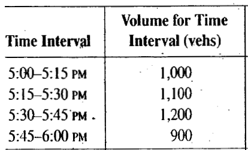{fig-align="center"}

## Sub-Hourly Volumes: Hourly Volume
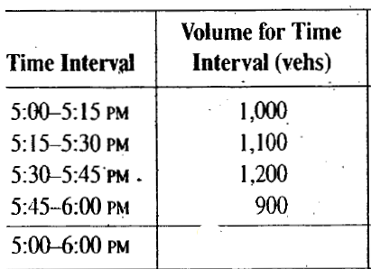{fig-align="center"}

## Sub-Hourly Volumes: Hourly Volume
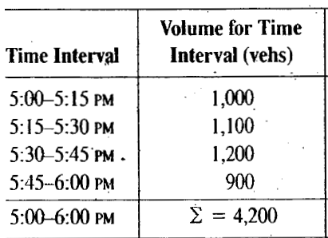{fig-align="center"}

## Sub-Hourly Volumes: Hourly Flow Rate
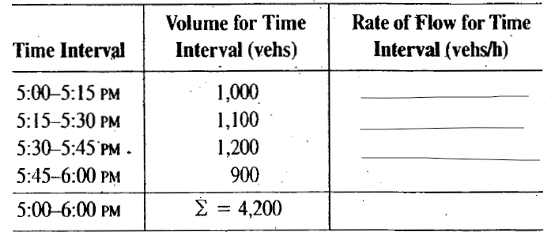{fig-align="center"}

## Sub-Hourly Volumes: Hourly Flow Rate
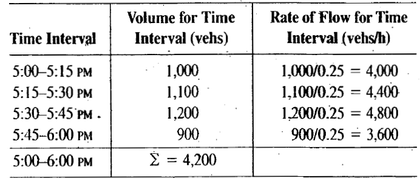{fig-align="center"}

## Sub-Hourly Volumes: Max. rate of Flow
- Max. rate of Flow:  The max. flow rate within the peak hour
- $Peak\ Hour\ Factor (PHF) = \frac{Hourly\ Volume}{max.\ rate\ of\ flow}$
- $PHF = \frac{V}{4*V_{m15}}$

## Sub-Hourly Volumes: Max. rate of Flow

{fig-align="center"}

. . . 

* $PHF = \frac{V}{4*V_{m15}}$
* $PHF = \frac{4200}{4*1200}$
* $PHF = 0.875$

## Speed and Travel Time

**Single Vehicle Speed**    
- distance traversed = speed x time to traverse distance    
- $d=S \times t$

. . . 

**Group Vehicle Speed**    
- **Time mean speed (TMS)**
  - The average speed of all vehicles passing a **point** on a highway or lane over some specified time period.    
- **Space mean speed (SMS)**
  - The average speed of all vehicles occupying a **given section of highway** or lane over some specified time period.
  
## Traffic Stream Speed
* $TMS, u = \frac{\sum_{i=1}^{n} u_i}{n}$
  - $u_i$: speed of veh $i$

. . . 

* $SMS, u_s = \frac{total\ dist.\ travelled\ by\ all\ veh}{travel\ time\ of\ all\ veh}$
* $SMS, u_s = \frac{nl}{\sum_{i=1}^{n} t_i}$
  - $l$: length of the roadway section
  - $t_i$: travel\ time\ of\ veh\ i $i$

## TMS vs. SMS
* SMS weights slower vehicles more heavily.
* TMS weights each vehicle equally.
* SMS $≤$ TMS
* SMS = TMS when all vehicles are traveling at the same speed.

## Speed and Travel Time: Problem
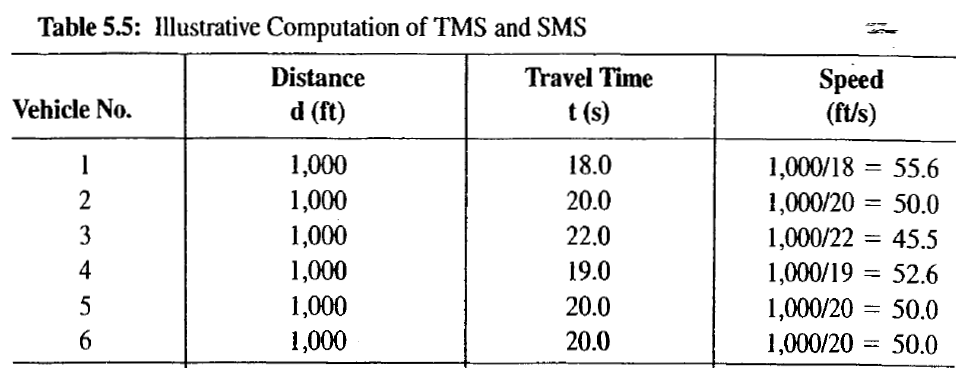{fig-align="center"}

## Speed and Travel Time: Solution
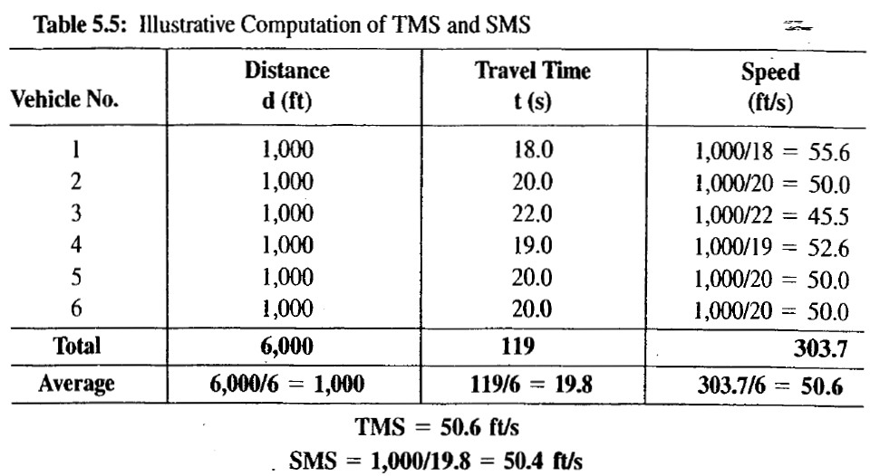{fig-align="center"}

## Density and Occupancy
* **Density**
  - the number of vehicles occupying a given length of highway or lane (veh/mile) at a given time
  - $D\ or\ k = \frac{n}{l}$

. . . 

* **Occupancy**
  - Proportion of time that a detector is "occupied"
  - $O = \frac{D(L_v + L_d)}{5,280}$
    - $L_v$: avg. length of vehicle
    - $L_d$: length of detector

## Headway and Spacing

* **Headway**: time interval between successive vehicles as they pass a point along the lane
(measured between common reference points on the vehicles).
  - $q = \frac{3600}{\bar{h}}$
    - $q$ = flow rate, veh/hr/ln and $\bar{h}$ = avg. headway in the lane, s
    
. . . 

* **Spacing**: distance between successive vehicles as they pass a point along the lane
(measured between common reference points on the vehicles).
  - $k = \frac{5280}{\bar{s}}$
    - $k$ = density, veh/mile and $\bar{s}$ = avg. spacing in the lane, ft
    

## Fundamental Identity

* Depicts relationship among Flow Rate, Speed, and Density
* $q= k \times u_s$
  - $q$ = Flow, veh/h or veh/h/ln
  - $k$ = density, veh/mi or veh/mi/ln
  - $u_s$ = SMS, mph

## Relationship: Problem
**Consider a freeway lane with a measured space mean speed of 60 mi/h and a flow rate of 1,000 veh/h/ln. What is the Density of the roadway segment?**

. . .  

* $q= k \times u_s$
* $k= \frac{q}{u_s}$
* $k= \frac{1000}{60} = 16.7 veh/mi/ln$

## Traffic Stream Models

:::: {.columns}

::: {.column width="50%"}
### Speed and Density

* $u_s = u_f(1 - \frac{k}{k_j})$
  - $u$: SMS, mph
  - $u_f$: Free-flow speed, mph
  - $k$: density, veh/mi
  - $k_j$: Jam density, veh/mi
  

:::

::: {.column width="50%"}
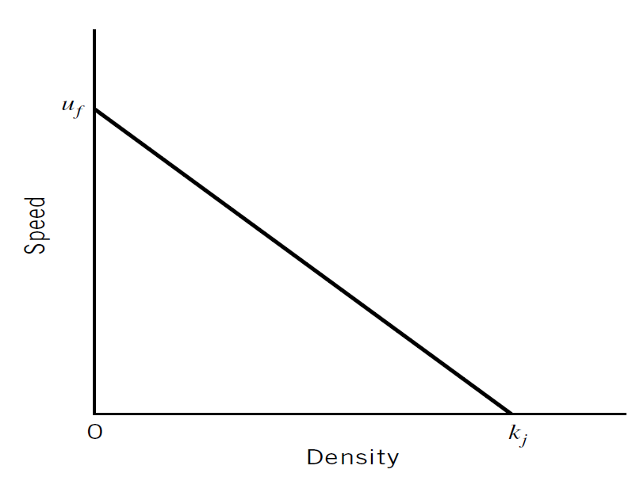
:::

::::

## Traffic Stream Models

:::: {.columns}

::: {.column width="50%"}
### Flow and Density
Using the assumption of a linear speed-density relationship, a parabolicflow-density model can be obtained by using the given u-k relation and fundamental identity.

* $q = k \times u_s$
* $q = k \times u_f(1 - \frac{k}{k_j})$
* $q = u_f(k - \frac{k^2}{k_j})$

:::

::: {.column width="50%"}
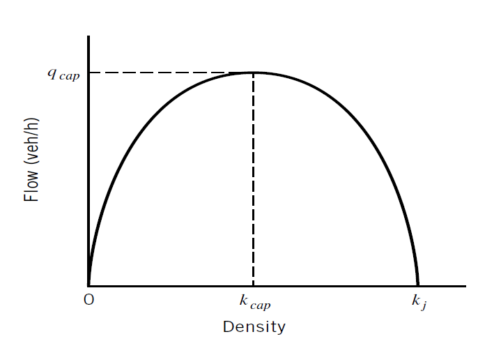
:::

::::

## Traffic Stream Models

:::: {.columns}

::: {.column width="50%"}
### Speed and Flow
Rearranging speed-density and using fundamental equation to find speed-flow relation

* $q = k_j(u - \frac{u^2}{u_f})$

:::

::: {.column width="50%"}
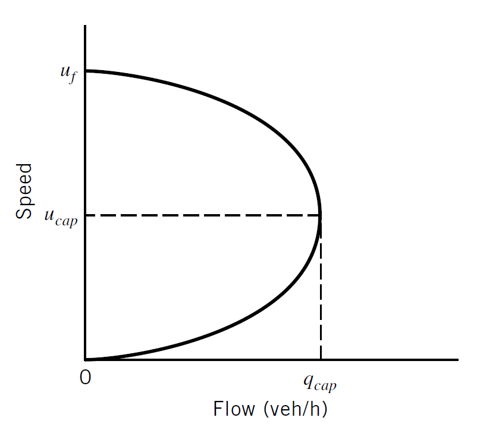
:::

::::

## Traffic Stream Models

**Functional Diagram of Traffic Flow**
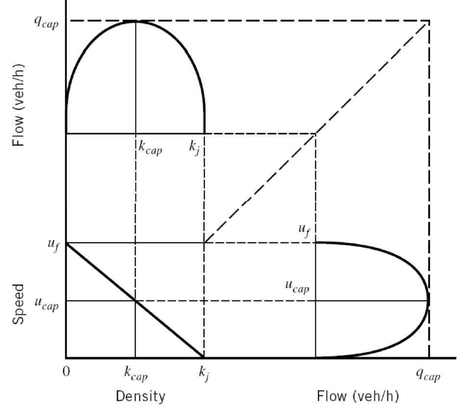

## Traffic Stream Models: Problem

**Given the following u-k relation, determine the q-k relation and flow capacity. What is the speed at maximum flow ($u_{cap}$)?**

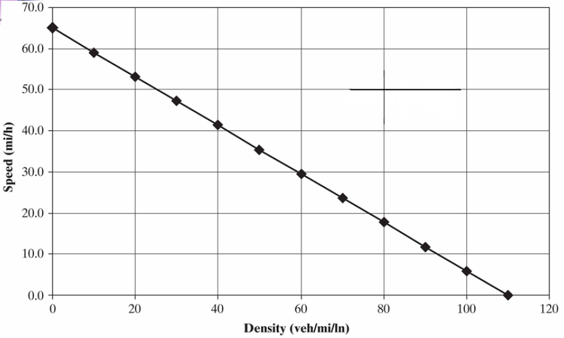

## Traffic Stream Models: Solution

:::: {.columns}

::: {.column width="50%"}
**Given the following u-k relation, determine the q-k relation and flow capacity. What is the speed at maximum flow ($u_{cap}$)?**

* <u>Find $u-k$ relation</u>

:::

::: {.column width="50%"}

:::

::::

## Traffic Stream Models: Solution
**Given the following u-k relation, determine the q-k relation and flow capacity. What is the speed at maximum flow ($u_{cap}$)?**

* <u>Find $q-k$ relation</u>

## Traffic Stream Models: Solution
**Given the following u-k relation, determine the q-k relation and flow capacity. What is the speed at maximum flow ($u_{cap}$)?**

* <u>Find $q-u$ relation</u>

## Traffic Stream Models: Solution

:::: {.columns}

::: {.column width="50%"}
**Given the following u-k relation, determine the q-k relation and flow capacity. What is the speed at maximum flow ($u_{cap}$)?**

* <u>Find $k_{cap}$</u>

:::

::: {.column width="50%"}

:::

::::

## Traffic Stream Models: Solution

:::: {.columns}

::: {.column width="50%"}
**Given the following u-k relation, determine the q-k relation and flow capacity. What is the speed at maximum flow ($u_{cap}$)?**

* <u>Find $u_{cap}$</u>

:::

::: {.column width="50%"}

:::

::::

## Traffic Stream Models: Solution
**Given the following u-k relation, determine the q-k relation and flow capacity. What is the speed at maximum flow ($u_{cap}$)?**

* <u>Find $q_{cap}$</u>

## Traffic Stream Models: Solution
**Given the following u-k relation, determine the q-k relation and flow capacity. What is the speed at maximum flow ($u_{cap}$)?**

* <u>ALL STEPS</u>

* $u_s = u_f(1 - \frac{k}{k_j})$
* $u_s = 65(1 - \frac{k}{110})$

 

* $u_s = 65(1 - \frac{k}{110})$
* $\frac{q}{k} = 65(1 - \frac{k}{110})$
* $q = 65k- 0.59091k^2$

 

* $u_s = 65(1 - \frac{k}{110})$
* $u_s = 65(1 - \frac{\frac{q}{u_s}}{110})$
* $q = 110u_s-1.6923u_s^2$

 

* $q = 65k- 0.59091k^2$
* $\frac{dq}{dk} = 65 -1.18182k$
* $65 -1.18182k_{cap} = 0$
* $k_{cap} = 55$ veh/h

 

* $q = 110u_s-1.6923u_s^2$
* $\frac{dq}{du_s} = 110-3.3846u_s$
* $110-3.3846u_s = 0$
* $u_{cap} = 32.5$ mph

 

* $q_{cap} = k_{cap} \times u_{cap}$
* $q_{cap} = 55 \times 32.5$
* $q_{cap} = 1,788$ veh/h
