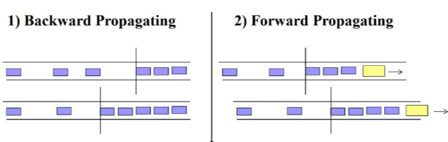
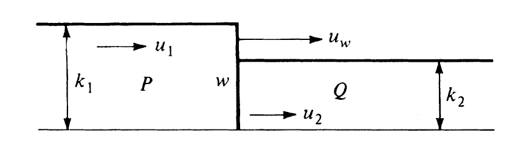
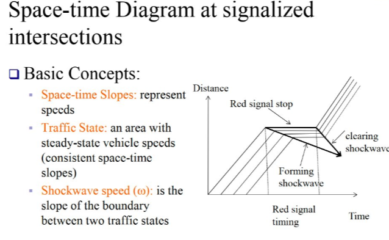
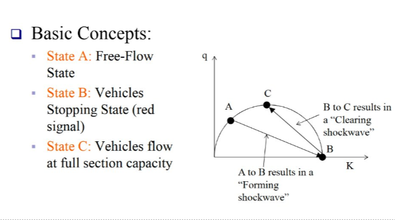
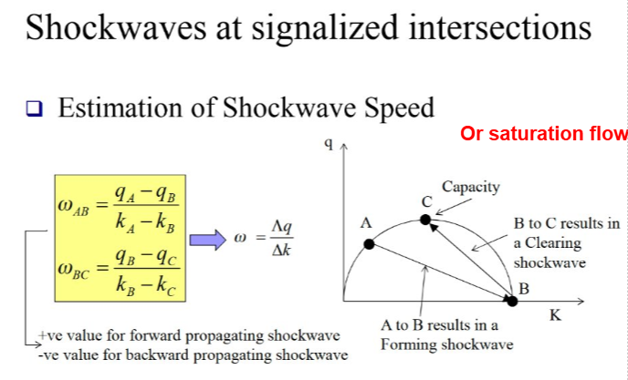
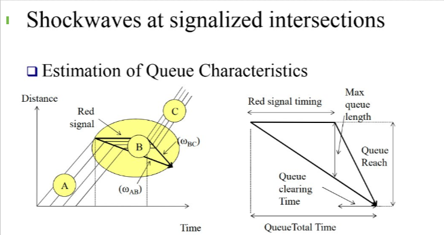

## Class Logistics (09/09/2026)

* HW 1 due today 11:59PM
  - Rubric uploaded
* Course Project
  - Update or Q/A?

## RECAP: Traffic Stream Characteristics 

* <u>Macroscopic variables</u>:
  - Volume: $V$ 
  - Flow
    - $q = \frac{n}{t}$ --> AADT, ADT, DDHV, PHF

. . . 

  - Speed
    - $TMS, u = \frac{\sum_{i=1}^{n} u_i}{n}$
    - $SMS, u_s = \frac{nl}{\sum_{i=1}^{n} t_i}$

. . . 

  - Density and Occupancy
    - $D\ or\ k = \frac{n}{l}$
    - $O = \frac{D(L_v + L_d)}{5,280}$

## RECAP: Traffic Stream Characteristics 
[Illustration: Headway and Spacing](https://homo-deus.com/lab/transportation/traffic-flow/?density=15&free_speed=120)

* <u>Microscopic variables</u>:
  - Headway
    - $q = \frac{3600}{\bar{h}}$
  - Spacing
    - $k = \frac{5280}{\bar{s}}$

## RECAP: Traffic Stream Characteristics
### Fundamental Identity

* Depicts relationship among Flow Rate, Speed, and Density
* $q= k \times u_s$
  - $q$ = Flow, veh/h or veh/h/ln
  - $k$ = density, veh/mi or veh/mi/ln
  - $u_s$ = SMS, mph

## Relationship: Problem
**Consider a freeway lane with a measured space mean speed of 60 mi/h and a flow rate of 1,000 veh/h/ln. What is the Density of the roadway segment?**

. . .  

* $q= k \times u_s$
* $k= \frac{q}{u_s}$
* $k= \frac{1000}{60} = 16.7 veh/mi/ln$

## Traffic Stream Models {.smaller}

:::: {.columns}

::: {.column width="50%"}
### Speed and Density: Greenshield's Linear model

* $u_s = u_f(1 - \frac{k}{k_j})$
  - $u$: SMS, mph
  - $u_f$: Free-flow speed, mph
  - $k$: density, veh/mi
  - $k_j$: Jam density, veh/mi
  
* Observations
  - At $k \approx 0$, $u=u_f$, no/few vehicles on the road, more speed
  - At $k=k_j$, $u=0$, more vehicles on the road, less speed

:::

::: {.column width="50%"}

:::

::::

## Traffic Stream Models {.smaller}

:::: {.columns}

::: {.column width="50%"}
### Flow and Density
Using the assumption of a linear speed-density relationship, a parabolicflow-density model can be obtained by using the given u-k relation and fundamental identity.

* $q = k \times u_s$
* $q = k \times u_f(1 - \frac{k}{k_j})$
* $q = u_f(k - \frac{k^2}{k_j})$

:::

::: {.column width="50%"}

* Observations
  - At $k \approx 0$, $q=0$, no vehicle, no flow
  - At $q=q_{max}$ at capacity, $k=k_c$, maximum flow
  - After $k>k_c$, flow drops
  - At $k>k_j$, no flow

:::

::::

## Traffic Stream Models {.smaller}

:::: {.columns}

::: {.column width="50%"}
### Speed and Flow
Rearranging speed-density and using fundamental equation to find speed-flow relation

* $q = k_j(u - \frac{u^2}{u_f})$

:::

::: {.column width="50%"}

* Observations:
  - same flow can occur under two very different traffic conditions (stable free flow and congested)
:::

::::

## Traffic Stream Models {.smaller}

**Functional Diagram of Traffic Flow**
{width="900px" height="600px"}

## Traffic Stream Models

[Interactive Traffic Stream Model](https://novasolver.jp/en/tools/traffic-flow.html?utm_source=chatgpt.com&sModel=greenshields&vkj=110&skj=110&skjNum=110&vuf=65&suf=65&sufNum=65&vk=1&sk=1#sModel=greenshields&vuf=65&suf=65&sufNum=65&vkj=110&skj=110&skNum=40&skjNum=110&vk=1&sk=1)

## Traffic Stream Models: Problem

**Given the following u-k relation, determine the q-k relation and flow capacity. What is the speed at maximum flow ($u_{cap}$)?**

## Traffic Stream Models: Solution

:::: {.columns}

::: {.column width="50%"}
**Given the following u-k relation, determine the q-k relation and flow capacity. What is the speed at maximum flow ($u_{cap}$)?**

* <u>Find $u-k$ relation</u>

:::

::: {.column width="50%"}

:::

::::

## Traffic Stream Models: Solution
**Given the following u-k relation, determine the q-k relation and flow capacity. What is the speed at maximum flow ($u_{cap}$)?**

* <u>Find $q-k$ relation</u>

## Traffic Stream Models: Solution
**Given the following u-k relation, determine the q-k relation and flow capacity. What is the speed at maximum flow ($u_{cap}$)?**

* <u>Find $q-u$ relation</u>

## Traffic Stream Models: Solution

:::: {.columns}

::: {.column width="50%"}
**Given the following u-k relation, determine the q-k relation and flow capacity. What is the speed at maximum flow ($u_{cap}$)?**

* <u>Find $k_{cap}$</u>

:::

::: {.column width="50%"}

:::

::::

## Traffic Stream Models: Solution

:::: {.columns}

::: {.column width="50%"}
**Given the following u-k relation, determine the q-k relation and flow capacity. What is the speed at maximum flow ($u_{cap}$)?**

* <u>Find $u_{cap}$</u>

:::

::: {.column width="50%"}

:::

::::

## Traffic Stream Models: Solution
**Given the following u-k relation, determine the q-k relation and flow capacity. What is the speed at maximum flow ($u_{cap}$)?**

* <u>Find $q_{cap}$</u>

## Traffic Stream Models: Solution
**Given the following u-k relation, determine the q-k relation and flow capacity. What is the speed at maximum flow ($u_{cap}$)?**

* <u>ALL STEPS</u>

* $u_s = u_f(1 - \frac{k}{k_j})$
* $u_s = 65(1 - \frac{k}{110})$

 

* $u_s = 65(1 - \frac{k}{110})$
* $\frac{q}{k} = 65(1 - \frac{k}{110})$
* $q = 65k- 0.59091k^2$

 

* $u_s = 65(1 - \frac{k}{110})$
* $u_s = 65(1 - \frac{\frac{q}{u_s}}{110})$
* $q = 110u_s-1.6923u_s^2$

 

* $q = 65k- 0.59091k^2$
* $\frac{dq}{dk} = 65 -1.18182k$
* $65 -1.18182k_{cap} = 0$
* $k_{cap} = 55$ veh/h

 

* $q = 110u_s-1.6923u_s^2$
* $\frac{dq}{du_s} = 110-3.3846u_s$
* $110-3.3846u_s = 0$
* $u_{cap} = 32.5$ mph

 

* $q_{cap} = k_{cap} \times u_{cap}$
* $q_{cap} = 55 \times 32.5$
* $q_{cap} = 1,788$ veh/h

## Traffic Shockwave

* Queing as a result of a sudden decrease in roadway capacity (lane reduction, traffic signal etc.)

* [Demo](https://seo.cv.ens.titech.ac.jp/traffic-flow-demo/bottleneck.html)

## Traffic Shockwave

## Traffic Shockwave Velocity

:::: {.columns}

::: {.column width="50%"}

:::

::: {.column width="50%"}

:::

::::

## Traffic Shockwave at Signalized Intersection

## Traffic Shockwave at Signalized Intersection

## Traffic Shockwave at Signalized Intersection

## Traffic Shockwave at Signalized Intersection

## Traffic Shockwave Problem
The southbound approach of a signalized intersection carries a flow of 1000 veh/h/ln at a velocity of 50 mi/h. The duration of the red signal indication for this approach is 15 sec. If the saturation flow is 2000 veh/h/ln with a density of 75 veh/ln, the jam density is 150 veh/mi, determine the following:

* a. The length of the queue at the end of the red phase
* b. The maximum queue length
* c. The time it takes for the queue to dissipate after the end of the red indication.
