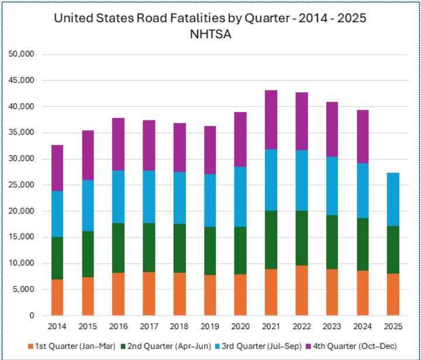
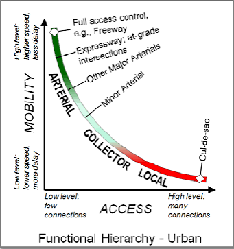
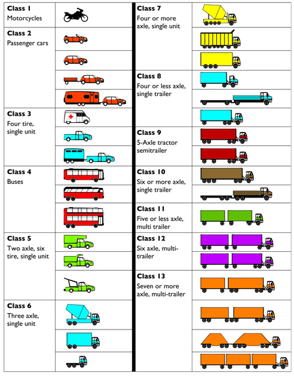

## What is Traffic Engineering?

ITE defines traffic engineering as a subset of transportation
engineering:

"Application of technology and scientific principles to the planning,
functional design, operation, and management of facilities for any mode
of transportation in order to provide for the safe, rapid, comfortable,
convenient, economical, and environmentally compatible movement of
people and goods."

## Primary Objective: SAFETY
- In recent years, fatalities on U.S. highways: between 40,000 and 43,000 per year.

## Mobility vs. Accessibility

:::: {.columns}

::: {.column width="50%"}
Mobility:    
- Through movement of people and goods
from point A to point B.    

Accessibility:   
-Direct connection to abutting lands and
land uses provided by roadways.
:::

::: {.column width="50%"}

:::

::::

## Transportation Modes

##

::: {.r-fit-text}
What's Missing?
:::

## Elements of Traffic Engineering
- Traffic studies and characteristics (e.g. volume)
- Performance evaluation (e.g. LOS)
- Facility design
- Traffic control (e.g. signs)
- Traffic operations (e.g. curb management)
- Transportation systems management (e.g. HOV)
- Integration of intelligent transportation system technologies (e.g. V2I communications)

## Modern Problems for the Traffic Engineer

- Growth management
- Reconstruction of existing highway facilities
- Security of transportation facilities
- Shift in trade pattern and consumer demands
- Emerging technologies

## Key Manuals and References

- ITE Traffic Engineering Handbook (7th edition)
- <mark>Manual on Uniform Traffic Control Devices (MUTCD)</mark>
- <mark>Highway Capacity Manual (HCM)</mark>
- ITE Trip Generation Manual
- ITE Traffic Control Devices Handbook
- ITE Transportation Impact Analyses for Site Development
