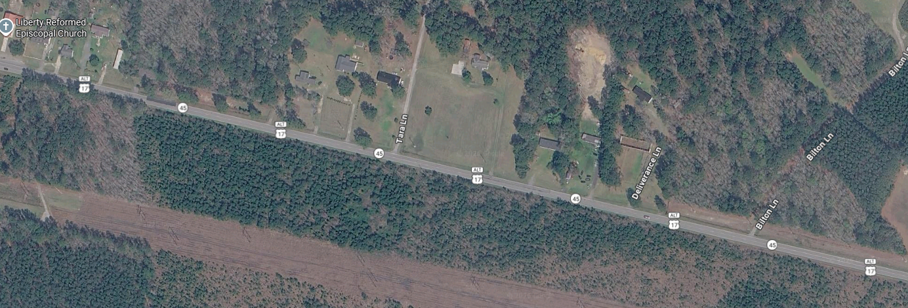
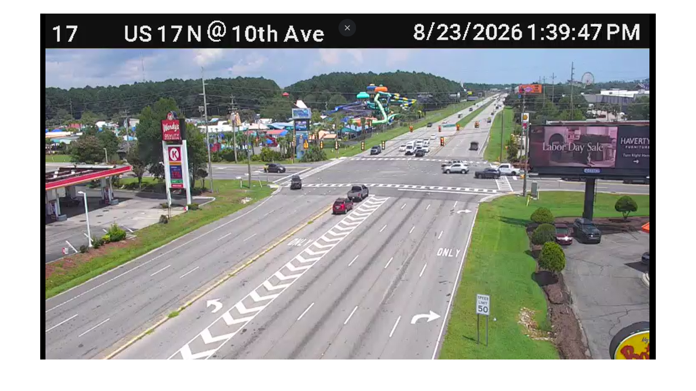
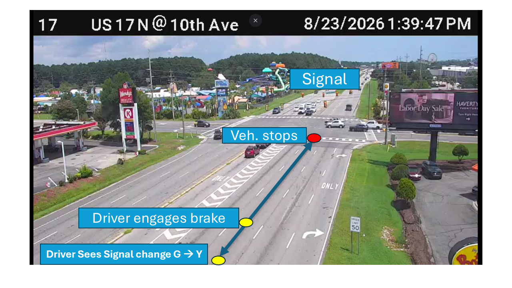
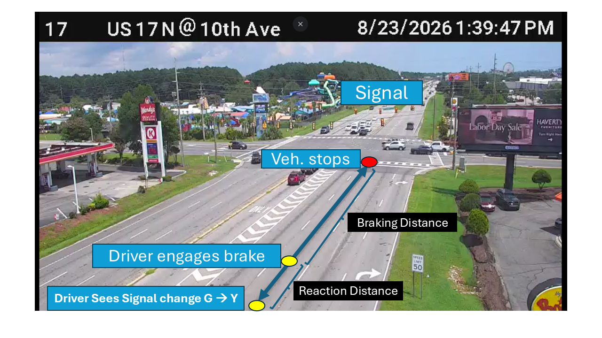
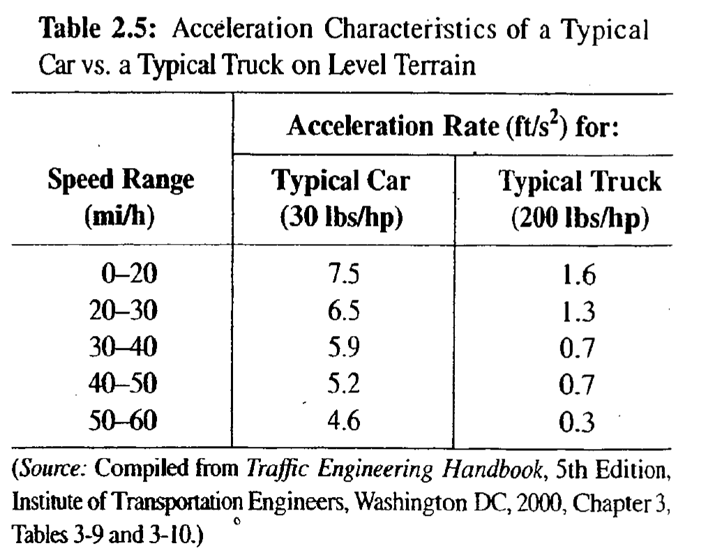
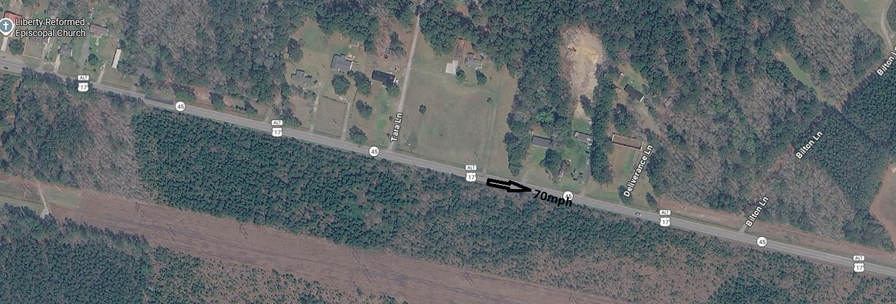
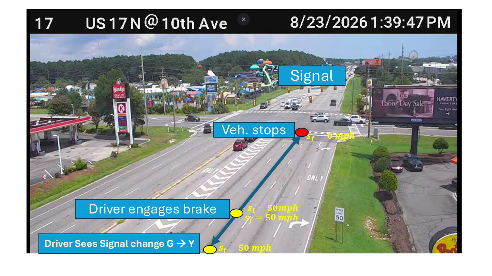
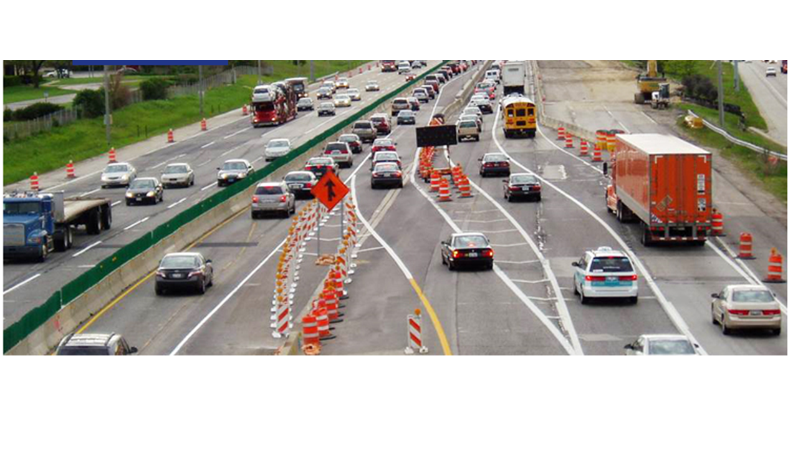
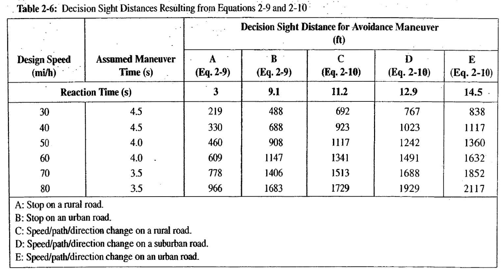

## PROBLEM 01
1. A section of rural freeway with design speed of 70 mph. On a section of level terrain, 500 feet of stopping sight distance is provided, is it safe? If not, what could be the implications of this sight?  

{fig-align="center"}


## PROBLEM 02
2. Given the roadway scenario, how long should the yellow interval of the signal?

{fig-align="center"}

## CONCEPTS

- Sight Distance (SD)

## SIGHT DISTANCE (SD)

* SD: How much of the roadway drivers' able to see (perceive)
* Types of SD:
  - <mark>Stopping SD (SSD)</mark>
  - <mark>Decision SD (DSD)</mark>
  - Passing SD (PSD)
  - Intersection SD (ISD)

## BASIC EQUATIONS

::::: columns
::: {.column width="40%"}
- $d = St$

- $S_f^2 = S_i^2 + 2ad$
:::

::: {.column width="60%"}
Where:

- $S_f$= final speed,<mark> $ft/s$ or $mph$</mark>
- $S_i$= initial speed, $ft/s$ or $mph$\
- $a$= acceleration/deceleration, $ft/s^2$
- $t$= time/duration, seconds ($s$) or hours ($h$)
- $d$= distance traveled, feet ($ft$)
:::
:::::

## UNIT CONVERTION

- 1 mile = 5280 feet
- 1 hour = 3600 sec

### Convert mph to ft/sec (fps)

::: {.r-fit-text .text-center .fragment}
$$1 mph = \frac{5280}{3600}  fps = 1.47 fps$$
:::

## Stopping SD: SSD

{fig-align="center"}

## Stopping SD: SSD

{fig-align="center"}

## Stopping SD: SSD

{fig-align="center"}

## Stopping SD: SSD

- SSD = Reaction Distance ($d_r$) + Braking Distance ($d_b$)

```{mermaid}
flowchart LR
  A[SSD] --> B("$$d_r$$")
  A --> C("$$d_b$$")
  B --> B1(PRT)
  C --> C1(Acceleration)
```

## SSD: Reaction Distance

**PRT ($t_r$) \~ Perception-Reaction Time**    
**PRT ($t_r$) \~ f(age, fatigue, complexity of roadway, DUI)**

. . .

$$d = St$$
$$d_r (ft) = S (fps) \times t_r(sec)$$
$$d_r (ft) = 1.47 \times S (mph) \times t_r(sec)$$

. . .

- AASHTO Design value: <mark>2.5 sec</mark>
- ITE Signal Design value: <mark>1 sec (Expectancy)</mark>


## SSD: Braking Distance {.scrollable}
::::: columns
::: {.column width="60%"}


- $S_f^2 = S_i^2 + 2ad_b$ 
- $$d_b=\frac{S_i^2 - S_f^2}{2a}$$
- $$d_b=\frac{S_i^2 - S_f^2}{2(Fg)}$$ 
- $$d_b=\frac{(1.47)^2 \times S_i^2 - S_f^2}{2(F \times 32.2)}$$ 
- $$d_b= \frac{S_i^2 - S_f^2}{30(F \pm G)}$$


:::

::: {.column width="40%"}
* $S_i$ or $S_f$: speed
* $d_b$: Braking Distance    
* $G$: Grade (%) 
* $F=\frac{a}{g}$: Coefficient of friction, 
* $a$: deceleration rate

:::
:::::


## SSD: Full Equation

- SSD = Reaction Distance ($d_r$) + Braking Distance ($d_b$)

```{mermaid}
flowchart LR
  A[SSD] --> B("$$d_r$$")
  A --> C("$$d_b$$")
  B --> B1(PRT)
  C --> C1(Acceleration)
```

* $d_{ssd}=d_r + d_b$
* $d_{ssd}=1.47S_i t + \frac{S_i^2 - S_f^2}{30(F \pm G)}$

## SSD: Full Equation

* $d_{ssd}=1.47S_i t + \frac{S_i^2 - S_f^2}{30(F \pm G)}$
* Design Stds:
  - $a = 11.2 fps$ -->  $F=\frac{a}{g}=\frac{11.2 f/s^2}{32.2 f/s^2}=0.348$

{fig-align="center"}

## PROBLEM 01
1. A section of rural freeway with design speed of 70 mph. On a section of level terrain, 500 feet of stopping sight distance is provided, is it safe? If not, what could be the implications of this sight?  

{fig-align="center"}

## PROB 01: UNDERSTAND (Part 1)
1. A section of rural freeway with design speed of 70 mph. On a section of level terrain, 500 feet of stopping sight distance is provided, is it safe? If not, what could be the implications of this sight?
{fig-align="center"}


## PROB 01: APPLY  (Part 1)
**1. A section of rural freeway with design speed of 70 mph. On a section of level terrain, 500 feet of stopping sight distance is provided, is it safe?** If not, what could be the implications of this sight?  

* $d_{ssd}=1.47S_i t + \frac{S_i^2 - S_f^2}{30(F \pm G)}$

. . .

* $d_{ssd}=1.47 \times 70 \times 2.5  + \frac{70^2 - 0^2}{30(0.348 \pm 0)}$
* $d_{ssd} = 257.3 + 469.3 = 726.6 ft$


## PROB 01: INTERPRET (Part 1)
**1. A section of rural freeway with design speed of 70 mph. On a section of level terrain, 500 feet of stopping sight distance is provided, is it safe?** If not, what could be the implications of this sight?  

. . . 

- Since $d_{ssd}$ = $726.6 ft$ is higher that $500 ft$, the provided SSD is **NOT** safe 

## PROB 01: UNDERSTAND (Part 2)
1. A section of rural freeway with design speed of 70 mph. On a section of level terrain, 500 feet of stopping sight distance is provided, is it safe? **If not, what could be the <mark>implications</mark> of the provided sight distance?**


## PROB 01: APPLY  (Part 2)
1. A section of rural freeway with design speed of 70 mph. On a section of level terrain, 500 feet of stopping sight distance is provided, is it safe? **If not, what could be the <mark>implications</mark> of the provided sight distance?**

* $d_{ssd}=1.47S_i t + \frac{S_i^2 - S_f^2}{30(F \pm G)}$

. . . 


* $500=1.47 \times 70 \times 2.5  + \frac{70^2 - S_f^2}{30(0.348 \pm 0)}$
* $S_f = 48.6 mph$


## PROB 01: INTERPRET (Part 2)
1. A section of rural freeway with design speed of 70 mph. On a section of level terrain, 500 feet of stopping sight distance is provided, is it safe? **If not, what could be the <mark>implications</mark> of the provided sight distance?**

. . . 

* If $500 ft$ is provided, the speed of the collision would be at a speed of $48.6mph$ 

## PROBLEM 02
2. Given the roadway scenario, how long should the yellow interval of the signal?

## PROB 02: UNDERSTAND
2. Given the roadway scenario, how long should the yellow interval of the signal?

{fig-align="center"}

## PROB 02: APPLY
2. Given the roadway scenario, how long should the yellow interval of the signal?

* $d_{ssd}=1.47S_i t + \frac{S_i^2 - S_f^2}{30(F \pm G)}$

. . . 

* $d_{ssd}=1.47 \times 50 \times 1  + \frac{50^2 - 0^2}{30(0.348 \pm 0)}$
* $d_{ssd} = 73.5 + 293.46 = 312.96 ft$

. . . 

yellow interval = Time it takes a  veh to travel 312.96 ft at a speed of 50mph

* yellow interval, $y = \frac{312.96}{50} = 6.25 sec$


## PROB 02: INTERPRET
2. Given the roadway scenario, how long should the yellow interval of the signal?

. . . 

* Yellow interval = 6.25 sec

## COMPLEX SCENARIOS for SD
{fig-align="center"}

## COMPLEX SCENARIOS for SD

* Interchange / Intersection
* Change in XS (e.g. lane drop)
* Toll Plaza

## Decision SD: DSD
* DSD: Sight distance based on collision-avoidance decision reaction time
* Stop Maneuver (A or B)
  - $d_{dsd}=1.47S_i t + \frac{S_i^2 - S_f^2}{30(F \pm G)}$
* Speed/path/direction change Maneuver (C/D/E)
  - $d_{dsd}=1.47 S_i (t_r + t_m)$
  - $t_r$: reaction time for appropriate avoidance maneuver, s
  - $t_m$: maneuver time, s


## Decision SD: DSD
::: {style="position: relative;  margin: auto;"}



::: {.absolute top=210 left=180 style="width: 150px; height: 175px; border: 8px solid #007bff;"}
$t_m$
:::

::: {.absolute top=170 left=360 style="width: 620px; height: 30px; border: 8px solid #007bff;"}
$t_r$
:::

:::

## Ch. 2: Road user and vehicle characteristics

END

